# SUPABASE MIGRATION BLUEPRINT — منصة بُنية

> وثيقة تدقيق هندسي ومخطط ترحيل نظري فقط — لا تحتوي SQL ولم تُنفّذ أي Migration أو أي اتصال بـ Supabase.

## نطاق التدقيق ومنهجيته

- تاريخ التدقيق: 2026-07-22.
- النطاق المقروء: كامل `src/` و`public/` و`docs/` و`scripts/` وملفات الإعداد، إضافة إلى قراءة مرجعية فقط للملف الموجود `supabase/migrations/001_bunya_production_schema.sql`.
- لم يُعدّل أي ملف في المشروع سوى إنشاء هذه الوثيقة، ولم يُنفّذ Git أو build أو migration أو اتصال خارجي.
- فُحصت شجرة الاستيراد بدءًا من App Router، وفُحصت الأنواع، مخازن `localStorage`، البيانات التجريبية، المعالجات، الحالات، التأثيرات، المسارات، CSS وPWA. نجح ESLint الحالي دون أخطاء، لكن نجاحه لا يعني سلامة منطق الإنتاج؛ 34 ملفًا يعطّل قواعد Hooks موضعيًا.
- الأرقام: 192 ملفًا داخل `src`، منها 178 TypeScript/TSX، و65 صفحة، و6 layouts، و74 ملف مكوّن، و31 ملف `lib`، و11 ملف CSS، و24 ملفًا عامًا. لا توجد `route.ts` ولا `middleware.ts` ولا `proxy.ts` ولا Server Actions.

## خلاصة تنفيذية

المشروع الحالي نموذج Frontend/PWA واسع الوظائف، وليس تطبيقًا متصلًا بخادم. نمذجة المجال غنية وتغطي خمسة أدوار: العميل، المزود، المقاول، السائق، والمدير؛ وتغطي مسارين تجاريين كبيرين: توريد المنتجات، وطلبات مشاريع المقاولات. لكن كل الهوية والصلاحيات وقواعد الأعمال والمالية والتدقيق تعمل داخل المتصفح ويمكن للمستخدم تغييرها من DevTools. البيانات ليست معزولة حسب المستخدم؛ معظم البوابات تستخدم ملفًا شخصيًا وحيدًا ومجموعات عامة لكل دور. لذلك لا يجوز تحويل دوال التخزين الحالية إلى استدعاءات Supabase واحدًا بواحد. المطلوب أولًا توحيد المصطلحات والكيانات والحالات، ثم بناء طبقة وصول خادمية/RLS، وبعدها ربط الواجهة تدريجيًا.

أخطر النتائج:

1. الحماية الحالية `RoleGuard` حماية عرض عميلة فقط؛ أي جلسة أو دور يمكن تزويره في `bunya-local-session`.
2. كلمات المرور التجريبية تُحوّل إلى SHA-256 ثابت بلا salt، وتوجد hashes وحسابات legacy داخل bundle العميل، ومسار reset لا يغير كلمة مرور أصلًا.
3. توجد ازدواجية مفاهيمية: `merchant` في أنواع ومسارات قديمة وSQL مقابل `provider` في الواجهة الحديثة؛ وازدواجية بين quote/order/delivery القديم والحديث.
4. المعاملات متعددة الكيانات غير ذرية: قبول عرض ينشئ طلبًا وفاتورة وأوامر fulfillment في عدة مفاتيح مستقلة؛ فشل منتصف العملية يترك حالة ممزقة.
5. بيانات كل دور singleton وليست مرتبطة بصاحب الجلسة؛ مستخدم جديد يرى بيانات Mock العامة وقد يعدلها.
6. المرفقات صور/ملفات metadata فقط، ولا يوجد تخزين فعلي أو فحص محتوى أو signed URLs.
7. ملف SQL الموجود ضخم وأحادي (أكثر من مئة جدول وسياسات كثيرة) وغير مستخدم من التطبيق أو مثبت الصحة؛ لا يُعد مصدر الحقيقة قبل reconciliation.

# 1. Architecture Review

## 1.1 البنية الحالية

البنية هي Next.js 16.2.9 App Router مع React 19.2.4 وTypeScript strict وTailwind 4 وGSAP/Three.js. صفحات `app/` غالبًا Server Components رقيقة تستورد مكوّنات عميلة كبيرة. البيانات كلها تأتي من ثوابت `src/lib/*-data.ts` أو `localStorage` عبر ثماني وحدات تخزين. لا توجد طبقة DAL أو API أو server-only logic.

```text
App Router page/layout
  -> Client feature component
     -> domain storage adapter
        -> localStorage key, or structuredClone(mock fallback)
     -> setState/useEffect
     -> CustomEvent داخل النافذة لبعض العدادات
```

الـ layouts المحمية هي العميل والمزود والمقاول والإدارة فقط. Layout السائق لا يستخدم `RoleGuard`؛ المكوّن نفسه يفحص الجلسة بعد hydration. الصفحة العامة والمنتجات والاشتراكات ودليل المقاولين والانضمام والمصادقة غير محمية.

## 1.2 طبقات البيانات الفعلية

| الطبقة | الملفات | الواقع الحالي | حكم التدقيق |
|---|---|---|---|
| الكتالوج القديم | `bunya-data.ts`, `bunya-order.ts`, `bunya-types.ts` | منتجات وRFQ وعروض وتوصيلات ثابتة | legacy demo، منفصل عن دورة المزود الحديثة |
| العميل | `customer-{types,data,storage}.ts` | profile واحد ومجموعات عامة | لا يوجد `customer_id` فعلي على أغلب السجلات |
| المزود | `provider-{types,data,storage}.ts` | profile واحد ومنتجات وعروض وطلبات ومالية | اسم المسار `/merchant` بينما الكيان Provider |
| المقاول | `contractor-{types,data,storage}.ts` | profile وخدمات وفرص وعروض ومشاريع | جيد كنموذج أولي، لكنه يضم nested aggregates كبيرة |
| التوريد الداخلي | `sourcing-{types,data,storage,engine}.ts` | اختيار أقل landed cost مؤهل وبناء عرض بُنية | منطق حساس يعمل في العميل وقابل للعبث |
| دورة المشروع | `project-request-{types,data,storage}.ts`, `project-policies.ts` | نشر، تعليق، مراجعة، قرار وتدقيق | النسخ والأحداث ليست ذرية ولا immutable |
| السائق | `driver-{types,storage}.ts` | حسابات وجلسات وإسناد وتأكيد | auth موازٍ ومختلف عن بقية الأدوار |
| الإدارة | `admin-{types,data,storage,adapters}.ts` | adapters تجمع كل المخازن وتنفذ قرارات | لا يوجد enforcement للصلاحيات الموجودة في الأنواع |

## 1.3 Next.js والتقسيم عميل/خادم

- الحدود العميلة واسعة؛ معظم منطق المجال يدخل bundle المتصفح.
- لا توجد قراءة Server Component من مصدر موثوق، ولا عمليات mutation خادمية، ولا تحقق ملكية عند العمليات.
- params الديناميكية تمر مباشرة إلى بحث محلي؛ عند الربط يجب اعتبار كل `[id]` إدخالًا غير موثوق والتحقق من UUID والملكية.
- لا يوجد Context ولا custom hooks. يوجد 411 `useState` و80 `useEffect` و23 `useMemo` و2 `useCallback`. هذا أدى لتكرار loading/read/filter/persist في كل شاشة.
- غالبية `useEffect` تقرأ مرة واحدة من `localStorage`. أحداث `bunya-*-data` تحدث في نفس التبويب فقط، ولا يوجد `storage` event للتبويبات الأخرى؛ لذلك تظهر حالات stale بين الشاشات.

## 1.4 PWA والأمن العام

- `sw.js` لا يخزن صفحات الأدوار الحساسة، ويستخدم network-only للتنقل مع fallback `/offline`؛ هذا قرار سليم مبدئيًا.
- الـ service worker يخزن assets ثابتة فقط، لكن أي بيانات حساسة مستقبلية يجب منع cache لها صراحة عبر headers.
- headers الحالية تضيف `nosniff` و`DENY` وReferrer Policy، بلا HSTS أو Permissions Policy أو CSP عام للتطبيق.
- `NEXT_PUBLIC_BUNYA_3D_EXPERIMENT` هو متغير البيئة الوحيد المرصود؛ لا توجد مفاتيح Supabase.

## 1.5 التناقض مع ملف Migration الموجود

الملف الموجود ينشئ مخططًا واسعًا وبـ RLS وBuckets، لكنه غير مربوط بالكود. لا يمكن اعتباره migration جاهزًا لأن هذه المهمة لم تشغّله ولم تتحقق من صحته. أبرز نقاط reconciliation:

- enum `user_role` يستخدم `merchant` بينما الجلسة الحديثة تستخدم `provider`.
- يوجد مساران قديمان وحديثان للعروض والتوصيل (`merchant_quotes/final_offers/deliveries` مقابل sourcing/provider assignments).
- حالات TypeScript لا تتطابق تمامًا مع enums SQL، مثل product review وfinancial status وdelivery status.
- التطبيق يتوقع arrays/nested objects كثيرة بينما SQL يفككها إلى جداول؛ يلزم adapters جديدة لا استبدال آلي.
- الملف الأحادي يصعّب rollback والاختبار؛ يجب تفكيكه إلى migrations مرتبة كما في القسم 16.

# 2. Project Tree Analysis

| المسار | المحتوى | التحليل |
|---|---|---|
| `src/app/` | App Router و65 صفحة و6 layouts | الصفحات wrappers رقيقة؛ لا API ولا loading/error/not-found boundaries مخصصة |
| `src/app/globals.css` | Tailwind import + أنماط عامة ومتجر ومصادقة | 2038 سطرًا و542 block؛ مسؤوليات كثيرة جدًا |
| `src/app/bunya-design-system.css` | tokens وطبقة توحيد | 143 block و161 `!important`؛ override layer لا design system مكوّن فعلي |
| `src/app/glass-theme.css` | theme/glass overrides | 223 block و405 `!important`؛ أعلى مصدر specificity debt |
| `src/app/*/*.css` | أنماط بوابات الأدوار | ملفات admin/customer/provider/contractor minified إلى أسطر ضخمة؛ صعبة المراجعة والصيانة |
| `src/components/` | المكوّنات العامة والبوابات | feature files كبيرة جدًا؛ بعض الملفات يحوي 4–8 شاشات كاملة في أسطر قليلة ضخمة |
| `src/components/customer/` | 17 شاشة عميل | الحساب، RFQ، الطلبات، المشاريع؛ كل شيء state محلي + storage |
| `src/components/provider/` | 15 شاشة مزود | منتجات، تسعير، أوامر، سائقون، مالية ودعم |
| `src/components/contractor/` | 16 شاشة مقاول | فرص وعروض ومشاريع وخدمات وملف ومستندات |
| `src/components/admin/` | dashboard وcatch-all modules | 30 وحدة افتراضية عبر `[...module]`؛ actions كثيرة لا تغيّر المصدر فعلًا |
| `src/components/driver/` | بوابة وتسليم وتغيير كلمة المرور | auth وتدفق مستقلان عن layouts المحمية |
| `src/components/home/` | المتجر والحركة وThree.js | تجربة عرض مستقلة عن كتالوج المزود الحديث |
| `src/lib/` | 31 ملف نوع/بيانات/تخزين/محرك | يمثل domain model الفعلي، لكن بلا ownership أو transactions |
| `public/` | PWA، صور، نماذج 3D، service worker | أصلان GLB متشابهان ونسختا PNG/WebP للخلفية؛ يلزم سياسة assets |
| `docs/` | product brief ومواد العلامة | الـ brief يصرح أن النظام Mock ويذكر قاعدة "الأرخص فقط"؛ الكود الحديث يستخدم أقل total landed cost المؤهل |
| `scripts/` | فحص حسابات demo وألوان foreground | فحوص محدودة؛ لا اختبارات وحدات/تكامل/مخطط |
| `supabase/migrations/` | ملف SQL موجود مسبقًا | مرجع غير مستخدم؛ لم يُنفذ أو يُعدّل |
| `tmp/` | فارغ | لا أثر تشغيلي |
| إعدادات الجذر | Next/TS/ESLint/PostCSS | strict مفعّل، `skipLibCheck` مفعّل، README افتراضي وغير واصف للنظام |

## 2.1 ملفات `lib` ملفًا بملف

| الملف | الوظيفة | الملاحظة الهندسية |
|---|---|---|
| `bunya-types.ts` | أنواع legacy والمتجر والانضمام | يخلط role `merchant` مع العالم الحديث `provider` |
| `bunya-data.ts` | 9 منتجات و9 تصنيفات نصية/أدوار | كتالوج عرض مستقل عن `providerProductsMock` |
| `bunya-order.ts` | 3 RFQ و4 عروض وtimeline | يحتوي handshake codes صريحة وبيانات legacy |
| `bunya-contractors.ts` | 3 ملفات دليل عامة | منفصل جزئيًا عن contractor profile الحديث |
| `bunya-subscriptions.ts` | خطتان 99/49 SAR | لا اشتراكات فعلية أو دورات فوترة |
| `bunya-local.ts` | IDs، hash، Maps parser، collections | SHA-256 غير صالح للمصادقة؛ short maps links لا تُحل |
| `demo-account-definitions.ts` | 3 حسابات وكلمة مرور/hash ثابت | بيانات اعتماد داخل client source |
| `demo-accounts.ts` | seed/repair محلي | development فقط، لكنه يخلق singleton profiles |
| `customer-types.ts` | أنواع العميل | order/items/history nested وتكرر كيانات عامة |
| `customer-data.ts` | mock العميل | يتضمن order قديمًا مرتبطًا بعرض غير موجود في sourcing الحالي |
| `customer-storage.ts` | تخزين ومزامنة وقبول العرض | mutation متعددة المفاتيح وغير ذرية؛ sync أحادي الاتجاه |
| `provider-types.ts` | أنواع المزود | يعيد تعريف `OrderStatus`, `ProductMeasurement`, `QuoteRequest` بأشكال مختلفة |
| `provider-data.ts` | mock المزود | orphan refs: `qr-legacy-2`, `pq-782` غير موجودين في مجموعاتهم |
| `provider-storage.ts` | CRUD collections وdelivery proof | لا ownership؛ fixed prefix SHA-256 للكود |
| `sourcing-types.ts` | pipeline الداخلي | أوضح نمذجة للتوريد لكنه يكرر customer order |
| `sourcing-data.ts` | أسعار/استجابات/اختيار/عرض | مزود `provider-build-pro` لا يملك profile في النظام |
| `sourcing-engine.ts` | eligibility والاختيار وبناء العرض | منطق مالي حساس client-side؛ VAT=0 إذا inclusive بدل تفكيك الضريبة المحاسبي |
| `contractor-types.ts` | مجال المقاول الكامل | aggregates كبيرة nested يجب تفكيكها |
| `contractor-data.ts` | mock المقاول | project يشير إلى `proposal-legacy-401` غير موجود؛ reviews تشير لمشاريع قديمة غير موجودة |
| `contractor-storage.ts` | CRUD وإنشاء مشروع من proposal | لا transaction؛ دفعة مقدمة تنشأ حتى إن كانت النسبة/الخطة غير متسقة |
| `project-request-types.ts` | طلبات المشروع والتعليقات والسياسات | جيد مفاهيميًا؛ snapshots كـ loose records |
| `project-request-data.ts` | mock الدورة | customerId=`customer-demo` يخالف demo id=`customer-adel` |
| `project-request-storage.ts` | نشر/فرص/سياسات/تنبيهات/audit | فرصة المشروع تنسخ الطلب إلى مخزن آخر فتخلق ازدواجية |
| `project-policies.ts` | 5 سياسات | نسخ السياسات ليست immutable في التخزين الحالي |
| `driver-types.ts` | driver/session/assignment/confirmation | LocalRole يستخدم provider لا merchant |
| `driver-storage.ts` | auth وإسناد وتأكيد وتسوية | تنفيذ صلاحيات ومالية كاملة في المتصفح؛ sessions يمكن تزويرها |
| `admin-types.ts` | RBAC/alerts/audit/settings | الصلاحيات نموذجية فقط ولا تحكم التنفيذ |
| `admin-data.ts` | roles/users/alerts/config | 6 أدوار و30 module، لكن actions كثيرة placeholders |
| `admin-storage.ts` | admin stores/audit | مفاتيح معلنة ليست ضمن Store: productReviews/orderActions/projectReviews/financeActions |
| `admin-adapters.ts` | توحيد كل المجالات للوحة الإدارة | adapter monolithic؛ actions غير المدعومة تعيد اسم action وكأنها نجحت |

# 3. Screens Analysis

## 3.1 الشاشات العامة والمصادقة

| Route | الشاشة/المصدر | البيانات والإجراءات | الملاحظات |
|---|---|---|---|
| `/` | `HomeStorefront` | 9 منتجات legacy، بحث/فلترة/عربة RFQ | العربة في `bunya-home-quote-items` بلا مستخدم |
| `/products` | `QuoteRequestFlow` | كتالوج وعرض تدفق قديم | لا يحفظ طلبًا حقيقيًا؛ منفصل عن دورة العميل |
| `/contractors` | `ContractorsDirectory` | 3 ملفات ثابتة + profile/portfolio الحديث | مزج مصدرين، وحفظ contractor عالمي |
| `/subscriptions` | `SubscriptionCard` | خطتا 99 و49 | CTA تجريبي بلا اشتراك أو دفع |
| `/login` | `LoginFlow.tsx` | customer/provider/contractor/driver/admin | بحث تسلسلي في localStorage + legacy hashes |
| `/register` | `AuthFlows.RegisterFlow` | إنشاء عميل وجلسة | uniqueness داخل customers فقط |
| `/forgot-password` | `ForgotPasswordFlow` | يسجل طلب reset | لا إرسال، لا rate limit، يكشف نجاحًا موحدًا فقط بالواجهة |
| `/reset-password` | `ResetPasswordFlow` | يسجل marker | لا يتحقق token ولا يغير credential |
| `/providers/join` | `ProviderJoinFlow` | بيانات منشأة/موقع/تصنيفات/توصيل | لا كلمة مرور ولا ملفات إثبات |
| `/contractors/join` | `ContractorJoinFlow` | مناطق/تخصصات/metadata مستندات | 5 ملفات ×5MB تحقق عميل فقط، ولا رفع فعلي |
| `/offline` | صفحة ثابتة | fallback آمن | لا تعرض بيانات حساسة |

## 3.2 شاشات العميل

| Route | الوظيفة | المصدر/الكتابة | ملاحظة |
|---|---|---|---|
| `/customer` | KPIs وآخر الطلبات | customer + sourcing stores | loading وهمي، غير scoped للجلسة |
| `/customer/quote-request/new` | إنشاء RFQ منتجات | cart/homeCart -> quoteRequests -> sourcing/provider | 36 ساعة deadline و45/60 دقيقة داخليًا hard-coded |
| `/customer/quote-requests` | بحث/فلترة RFQs | customer quoteRequests | الحالات نصية بلا workflow server |
| `/customer/quote-requests/[id]` | timeline وعرض بُنية/قرار | customer+sourcing؛ قبول ينشئ order/invoice/fulfillment | أخطر mutation متعددة المخازن |
| `/customer/quotes` | جدول عروض بُنية | sourcing quotes | يعرض جميع quotes العالمية |
| `/customer/orders` | قائمة الطلبات | customer orders synced من provider | sync جزئي يختار أول fulfillment فقط |
| `/customer/orders/[id]` | تفاصيل/history/invoice | orders+invoices | لا تحقق ملكية ID |
| `/customer/deliveries` | الشحنات | customer deliveries/codes | الكود/المحاولات من sync محلي |
| `/customer/billing` | الفواتير | customer invoices | لا payment records حقيقية |
| `/customer/project-requests` | قائمة طلبات مشاريع | project requests | لا filter بـ customerId الحالي |
| `/customer/project-requests/new` | wizard من 5 خطوات | project requests/policy acceptance | metadata فقط؛ الانتقال بين الخطوات لا يمنع تخطي validation مرحلي |
| `/customer/project-requests/[id]` | تفاصيل/تعليقات/عروض/قرارات | project+contractor stores | parseInt لمدة نصية يفقد الوحدة والمعنى |
| `/customer/notifications` | قراءة/فلترة | customer notifications | write محلي، لا realtime |
| `/customer/addresses` | CRUD عناوين | customer addresses | default uniqueness بالواجهة فقط |
| `/customer/contractors` | المحفوظون | saved contractors | IDs قد لا تشير إلى ملف حديث |
| `/customer/profile` | الملف/التفضيلات/كلمة المرور | customer profile | تغيير كلمة المرور يحسب proof لكن لا يحدّث registration credential بشكل موثوق |
| `/customer/support` | tickets/attachments | customer tickets | metadata فقط ولا محادثات تذكرة |

## 3.3 شاشات المزود (`/merchant`)

| Route | الوظيفة | المصدر/الكتابة | ملاحظة |
|---|---|---|---|
| `/merchant` | KPIs وأسعار وأوامر | provider+sourcing | provider profile hard-coded في filtering |
| `/merchant/products` | بحث/فلترة/preview/delete/price confirm | products+sourcing prices | حذف/سعر بلا مراجعة ذرية |
| `/merchant/products/new` | إنشاء/تعديل منتج | provider products | query `edit` عميل؛ blob URLs لا تُلغى كلها |
| `/merchant/quote-requests` | طلبات تحقق | provider quoteRequests | بيانات عميل masked نصيًا فقط |
| `/merchant/quote-requests/[id]` | توفر/كمية/سعر/توصيل | responses/prices | المزود يحدد كل الحقول client-side؛ لا idempotency |
| `/merchant/quotes` | الاستجابات المرسلة | sourcing responses | ليست `providerQuotesMock`؛ ازدواج تسمية |
| `/merchant/quotes/[id]` | تفاصيل response | sourcing | لا تعديل/نسخ محفوظة كاملة |
| `/merchant/orders` | أوامر fulfillment | provider orders | ليست customer order نفسها |
| `/merchant/orders/[id]` | transition وتجهيز/توصيل | orders/deliveries/transactions | transition map جيد مبدئيًا لكن قابل للتعديل؛ proof ثابت عند إنشاء delivery |
| `/merchant/drivers` | CRUD status/reset/assign | driver stores | temp password يظهر للمزود؛ auth موازٍ |
| `/merchant/drivers/new` | إنشاء سائق | driver store | uniqueness محلي فقط |
| `/merchant/finance` | ledger/settlements | transactions/settlements | balanceAfter مخزن لا مشتق؛ قابل للتلاعب |
| `/merchant/notifications` | read/filter | provider notifications | عالمي لمزود واحد |
| `/merchant/profile` | بيانات وبنوك وشعار | provider profile | bank account display فقط وlogo session preview |
| `/merchant/support` | سياسات/FAQ/tickets | provider tickets | attachments metadata فقط |

## 3.4 شاشات المقاول

| Route | الوظيفة | المصدر/الكتابة | ملاحظة |
|---|---|---|---|
| `/contractor` | KPIs/فرص/مشاريع/وثائق | contractor+project | singleton contractor |
| `/contractor/opportunities` | match/filter | project requests + opportunities | المطابقة محسوبة في العميل وقد تتكرر الفرص |
| `/contractor/opportunities/[id]` | تفاصيل وتعليقات دورة المشروع | request/comments | route يستخدم CycleDetails لا `ContractorOpportunityDetails` المصدّر الآخر |
| `/contractor/project-comments` | سجل التعليقات | project comments | filter بالـ mock contractor id |
| `/contractor/proposals` | قائمة العروض | contractor proposals | لا ownership من session |
| `/contractor/proposals/[id]` | تفاصيل/withdraw/accept simulation | proposals/projects | قبول العرض قد ينشئ المشروع client-side |
| `/contractor/projects` | قائمة المشاريع | contractor projects | nested milestones/updates |
| `/contractor/projects/[id]` | تقدم/دليل/تقارير | projects | المقاول يستطيع approve milestone في بعض التدفق، ويجب أن يكون العميل/الإدارة |
| `/contractor/services` | CRUD خدمات | services | status مراجعة قابل للتغيير محليًا |
| `/contractor/portfolio` | CRUD media/PDF | portfolio | metadata فقط |
| `/contractor/reviews` | رد على تقييم | reviews | التقييمات القديمة orphan |
| `/contractor/finance` | معاملات/تسويات | transactions/settlements | لا ledger موثوق |
| `/contractor/notifications` | read/filter | notifications | لا realtime |
| `/contractor/profile` | ملف مهني | profile | مقارنة الحقول الحساسة بالـ Mock لا بالنسخة المحفوظة |
| `/contractor/verification` | الوثائق | documents | metadata وحالات مراجعة محلية |
| `/contractor/support` | تذاكر وسياسات | tickets | metadata فقط |

## 3.5 السائق والإدارة

| Route | الوظيفة | الملاحظة |
|---|---|---|
| `/driver` | مهام السائق، transitions، تأكيد أو تعذر | الفحص داخل component بعد render؛ لا Layout guard |
| `/driver/change-password` | فرض تغيير كلمة المرور | proof محلي؛ session الحالية لا تُدوّر بعد التغيير |
| `/admin` | 16 KPI ومالية وطوابير | عمولات 5% hard-coded ومؤشرات مشتقة من mocks |
| `/admin/project-comments` | مراجعة requests/comments | خاص خارج catch-all |
| `/admin/project-comments/[id]` | قرار تفصيلي | ينشئ change request/review/audit محليًا |
| `/admin/[...module]` | نحو 30 وحدة افتراضية | fallback لأي path مجهول إلى users؛ لا 404 |

الوحدات الإدارية داخل catch-all: operations، alerts، users، join requests، drivers، admins، catalog، product review، pricing، sourcing، Bunya quotes، quote requests، orders، deliveries، delivery monitoring، delivery codes، project requests/opportunities/proposals/projects/documents/reviews، finance، settlements، invoices، notifications، support، policies، audit، settings. فقط subset من actions يغيّر المصدر؛ البقية تسجل قرارًا أو تعيد اسم الإجراء بما يوحي بنجاح زائف.

# 4. Components Analysis

## 4.1 المكوّنات المستخدمة

| الملف/المكوّنات | الدور | ملاحظات التدقيق |
|---|---|---|
| `HomeStorefront.tsx` | متجر، modal منتج، cart | 11 states و4 effects؛ مصدر legacy؛ cart بلا مالك |
| `home/HomeStorefrontUi.tsx` | عناصر عرض المتجر | presentational، لكن يسمى `ProductCard` بالتوازي مع مكوّن قديم |
| `home/BunyaHero3D.tsx` | Three.js GLB | يستخدم `any` واحدًا؛ cleanup موجود ويجب مراقبة GPU |
| `home/BunyaHomeMotion.tsx`, `BunyaLogoIntro.tsx` | motion/intro | callbackان الوحيدان تقريبًا؛ ليست من مجال البيانات |
| `LoginFlow.tsx` | login الفعلي | نسخة أحدث من Login داخل AuthFlows؛ يحتوي legacy accounts |
| `AuthFlows.tsx` | register/reset + Login غير مستخدم | ازدواج يسبب divergence؛ reset شكلي |
| `JoinApplications.tsx` | provider/contractor applications | تحقق عميل فقط، metadata مستندات |
| `PortalUI.tsx` | عناصر auth/forms/files | file limits ثابتة؛ لا content scan |
| `ContractorsDirectory.tsx` | الدليل والحفظ | يمزج static directory وprofile حديث |
| `QuoteRequestFlow.tsx` | demo RFQ في `/products` | لا persistence؛ منفصل عن العميل |
| `AppShell.tsx`, `AnimatedPage.tsx`, `RolePageHeader.tsx`, `StatusBadge.tsx`, `SubscriptionCard.tsx`, `ProductCard.tsx`, `ProductFilters.tsx` | shell/presentation | بعضها legacy لكنه reachable من صفحات عامة |
| `RoleGuard.tsx` | client redirect | ليس authorization؛ يبقي `allowed=true` عند تغير session داخل نفس mount |
| `PwaRuntime.tsx`, `PwaInstallPrompt.tsx` | SW/install | install prompt غير مركب في root حاليًا؛ `PwaRuntime` فقط مركب |
| `BunyaVisualRuntime.tsx` | focus trap عام | MutationObserver واسع على body؛ close يعتمد نص/selector |
| `ThemeToggle.tsx` | theme | reachable عبر AppShell فقط؛ قيم localStorage بلا validation |
| `customer/CustomerShell.tsx` | nav/unread | profile Mock في العنوان بدل session/profile stored |
| `customer/CustomerDashboard.tsx` | dashboard | reads متعددة بعد timeout تجريبي |
| `customer/CustomerQuotePages.tsx` | 4 شاشات RFQ/quote | mutation غير ذرية، direct location redirects |
| `customer/CustomerOrderPages.tsx` | 4 شاشات order/delivery/billing | sync غير كامل، لا ownership |
| `customer/CustomerProjectRequestPages.tsx` | 3 شاشات مشاريع | ملف ضخم، wizard وقرارات ودورة حياة في ملف واحد |
| `customer/CustomerAccountPages.tsx` | 5 شاشات حساب | profile/password/address/ticket منطق متفرق |
| `customer/CustomerUI.tsx` | primitives/status labels | status dictionary واسع وغير type-safe |
| `provider/ProviderShell.tsx` | nav/unread | singleton profile |
| `provider/ProviderDashboard.tsx` | dashboard | filter بـ `providerProfileMock.id` |
| `provider/ProviderProducts.tsx`, `ProviderProductForm.tsx` | كتالوج المزود | price/product writes مستقلة؛ object URLs |
| `provider/ProviderQuoteRequests.tsx`, `ProviderSentQuotes.tsx` | sourcing responses | business rules في client؛ provider quote legacy غير مستخدم فعليًا |
| `provider/ProviderOrders.tsx`, `ProviderDeliveryConfirmation.tsx` | order/delivery | transitions محددة لكن proof افتراضي ثابت |
| `provider/ProviderDrivers.tsx` | السائقون والإسناد | status/reset/assign في component واحد |
| `provider/ProviderFinance.tsx` | المالية | settlement validation واجهة فقط |
| `provider/ProviderProfilePage.tsx`, `ProviderNotifications.tsx`, `ProviderSupport.tsx` | الحساب والتواصل | لا ownership ولا backend |
| `provider/ProviderUI.tsx` | primitives | status labels غير مركزية مع العميل/المقاول |
| `contractor/ContractorShell.tsx` | nav/profile/unread | singleton profile |
| `contractor/ContractorDashboard.tsx` | dashboard | profile وIDs mock |
| `contractor/ContractorOpportunityPages.tsx` | فرص + ProposalForm | 30 states؛ purity rule معطلة؛ stages/payments nested |
| `contractor/ContractorProjectComments.tsx` | تعليقات وسياسات | يربط contractorProfileMock لا session |
| `contractor/ContractorProposalProjectPages.tsx` | proposal/project | إنشاء مشروع ومالية client-side |
| `contractor/ContractorBusinessPages.tsx` | 4 شاشات | خدمات/portfolio/reviews/finance في ملف واحد |
| `contractor/ContractorAccountPages.tsx` | 4 شاشات | profile/verification/support مع metadata فقط |
| `contractor/ContractorUI.tsx` | primitives/files | لا حد موحد معلن لكل file use case |
| `admin/AdminShell.tsx` | nav/search/alerts | البحث في أسماء الوحدات لا البيانات |
| `admin/AdminDashboard.tsx` | executive dashboard | commission Mock وقراءة direct key واحدة خارج adapters |
| `admin/AdminRoute.tsx` | catch-all dispatcher | unknown route => users بدل not-found |
| `admin/AdminModulePage.tsx` | list/detail/action عام | actions غير مدعومة تبدو ناجحة |
| `admin/AdminOperationsPages.tsx` | operations/alerts/settings | override/retry محليان؛ permissions غير مطبقة |
| `admin/AdminDriverMonitoring.tsx` | مراقبة drivers/deliveries | admin يستطيع status مباشرة من العميل |
| `admin/AdminProjectComments.tsx` | review workflow | أكثر جزء إداري ترابطًا، لكنه غير ذري |
| `admin/AdminUI.tsx` | primitives/dialog | reason minimum UI only |
| `driver/DriverPortal.tsx` | driver + password | 11 states؛ auth/assignment/status/confirmation في عميل واحد |
| `brand/BunyaLogo.tsx`, `ProjectPolicyModal.tsx` | عرض | سليمة نسبيًا |

## 4.2 مكوّنات غير مستخدمة من أي Route

فحص dependency graph أثبت أن الملفات التالية غير قابلة للوصول من `src/app`: `DashboardStatCard.tsx`, `EmptyState.tsx`, `FinalOfferCard.tsx`, `GlassCard.tsx`, `MerchantQuoteWorkbench.tsx`, `MotionCard.tsx`, `OrderStatusCard.tsx`, `OrderTimeline.tsx`, `PrivacyNotice.tsx`, `provider/DriverVerificationPortal.tsx`, `SectionTitle.tsx`، إضافة إلى declaration `home/three-runtime.d.ts` الذي ليس مكوّن runtime. هذه تمثل واجهة legacy؛ لا تُنقل إلى قاعدة البيانات قبل قرار حذف/إحياء.

## 4.3 Hooks والحالة والمعالجات

- لا Context ولا custom hooks؛ لا cache/query layer.
- 411 `useState` تعكس forms كثيفة، لكن state schemas غير قابلة لإعادة الاستخدام أو validation موحد.
- 80 `useEffect`، أغلبها hydration reads أو timers. 34 ملفًا يعطل `react-hooks/set-state-in-effect`; هذا ليس خطأ runtime بحد ذاته لكنه يخفي pattern واسعًا يجب استبداله ببيانات خادمية أو store/query hook.
- `useMemo` يُستخدم غالبًا للفلترة المحلية، وهو مناسب، لكن بعض القيم تقرأ storage داخل memo ولا تتحدث عند تغيره.
- Event handlers تنفذ mutations مركبة مباشرة. يجب تحويل كل submit/approve/accept/confirm/settle/status transition إلى command خادمي واحد idempotent مع transaction وauthorization.

# 5. Data Flow

## 5.1 دورة توريد منتج حالية

```text
Home cart / Customer cart
 -> CustomerQuoteRequest
 -> publishRequestToProvider
 -> InternalSourcingRequest + Provider QuoteRequest copies
 -> ProviderPricingResponse + ProviderProductPrice
 -> selectBestEligibleProviderPerItem
 -> InternalSelectionResult
 -> BunyaCustomerQuote
 -> customer accepts
 -> CustomerOrder + Invoice + InternalFulfillmentOrder(s) + ProviderOrder(s)
 -> Provider status -> DeliveryAssignment
 -> Driver assignment/status/code confirmation
 -> ProviderOrder completed + FinancialTransaction available
 -> Customer sync reads provider state
```

الفجوات: لا يوجد orchestrator فعلي يستدعي محرك الاختيار تلقائيًا في كل التدفقات، ولا transaction، ولا outbox، ولا idempotency key، ولا قفل optimistic، والنسخ المتعددة للسجل نفسه قد تختلف.

## 5.2 دورة مشروع مقاولات

```text
CustomerProjectRequest draft
 -> pending_admin_review + policy acceptance
 -> admin publish
 -> copied ContractorOpportunity
 -> contractor comment -> admin review -> customer change decision
 -> contractor proposal (stages + payments)
 -> accepted proposal
 -> ContractorProject (milestones + updates)
 -> financial transaction / settlement / review
```

الفجوات: opportunity نسخة materialized في localStorage وليست view/target؛ عرض المقاول لا يحتوي contractor_id صريحًا؛ قبول proposal وموافقة milestone ليست command محكومة؛ بيانات العميل المحمية عبارة عن label فقط وليست projection/RLS.

## 5.3 مصادر البيانات

1. Mock ثابت: جميع `*-data.ts` و`bunya-data/order/contractors/subscriptions`.
2. Browser persistence: مفاتيح `localStorage` في القسم 7.
3. Derived client data: KPIs، balances، eligibility، timelines، status labels.
4. Browser/device: الوقت، `crypto.randomUUID`، Google Maps URL parser، PWA APIs، blob URLs.
5. لا يوجد fetch/axios/database/realtime/server data source.

# 6. State Flow

- كل شاشة تبدأ غالبًا بـ Mock لتفادي mismatch ثم `useEffect` يستبدله بقيمة storage. هذا يسبب ومضة بيانات Mock وقد يعرض record لا يخص المستخدم قبل hydration.
- الكتابة تحدث عبر `writeCustomer/writeProvider/writeContractor/writeSourcing/writeProjectStore/writeAdmin` وتطلق `CustomEvent`. غالبية الشاشات لا تستمع للأحداث؛ shells فقط تحدث unread counters، لذلك الرجوع/التنقل هو وسيلة refresh الفعلية.
- `readCustomer` يجري sync مشتقًا عند القراءة للطلبات/التوصيلات/الأكواد؛ القراءة هنا ذات معنى business reconciliation، ما يصعّب الاختبار.
- حالات dialogs وtoasts/forms موزعة في ملفات ضخمة. لا reducer ولا state machine؛ transitions هي maps/if conditions متفرقة.
- بعد Supabase: البيانات الخادمية عبر Server Components أو query hooks؛ form state يبقى محليًا؛ transitions تُستدعى كcommands؛ Realtime فقط للإشعارات وحالات التشغيل، لا كمصدر حقيقة.

# 7. LocalStorage Audit

## 7.1 مفاتيح الهوية والجلسة والتجربة

| المفتاح | المستخدم | الغرض/المصير |
|---|---|---|
| `bunya-local-session` | Login/RoleGuard/all shells/driver | جلسة قابلة للتزوير؛ تُحذف وتستبدل بـ Supabase Auth session (لا تُرحّل) |
| `bunya-auth-return-to` | RoleGuard/login/directory | redirect مؤقت؛ يمكن إبقاؤه sessionStorage بعد whitelist |
| `bunya-customer-registrations` | register/login/admin/demo | حسابات + passwordProof؛ تُستورد فقط في بيئة demo منفصلة، لا إنتاج |
| `bunya-provider-applications` | join/login/admin/demo | طلبات انضمام؛ ترحيل انتقائي بعد dedupe |
| `bunya-contractor-applications` | join/login/admin/demo | طلبات ومستندات metadata؛ ترحيل انتقائي |
| `bunya-password-reset-requests` | forgot password | طلبات وهمية؛ لا تُرحّل |
| `bunya-local-password-reset` | reset password | marker وهمي؛ لا يُرحّل |
| `bunya-demo-seed-version` | demo bootstrap | إصدار seed؛ لا يُرحّل |
| `bunya-edit-project-request` | customer project form | pointer تحرير مؤقت؛ يستبدل route param/server fetch |
| `bunya-theme` | ThemeToggle | preference غير حساسة؛ يمكن إبقاؤها محليًا |

## 7.2 العميل

| المفتاح | البيانات | المستخدمون |
|---|---|---|
| `bunya-customer-profile` | CustomerProfile singleton | profile/shell/demo |
| `bunya-customer-addresses` | addresses | addresses/new RFQ |
| `bunya-customer-quote-cart` | cart | CustomerNewQuoteRequest |
| `bunya-home-quote-items` | public home cart | HomeStorefront -> CustomerNewQuoteRequest |
| `bunya-customer-quote-requests` | RFQs | customer pages/admin/sourcing bridge |
| `bunya-customer-received-quotes` | legacy ReceivedProviderQuote[] | customer storage فقط تقريبًا؛ empty default |
| `bunya-customer-orders` | customer orders | dashboard/orders/admin/sync |
| `bunya-customer-deliveries` | customer projections | deliveries/sync |
| `bunya-customer-delivery-codes` | proofs/attempts | deliveries/sync؛ حساس |
| `bunya-customer-invoices` | invoices | billing/order/admin |
| `bunya-customer-notifications` | notifications | shell/page/admin |
| `bunya-customer-saved-contractors` | saved IDs | directory/customer contractors |
| `bunya-customer-support-tickets` | tickets | support/admin |
| `bunya-customer-sidebar-state` | collapsed/expanded | shell؛ غير حساس |

## 7.3 المزود والتوريد

| المفتاح | البيانات |
|---|---|
| `bunya-provider-profile` | ProviderProfile singleton + bank accounts |
| `bunya-provider-products` | products/images/units/measurements/warranty/delivery nested |
| `bunya-provider-quote-requests` | copies من sourcing requests |
| `bunya-provider-quotes` | legacy ProviderQuote[]؛ الواجهة الحديثة تعتمد responses بدلًا منه |
| `bunya-provider-orders` | fulfillment orders |
| `bunya-provider-deliveries` | legacy delivery assignments |
| `bunya-provider-financial-transactions` | ledger-like rows/balanceAfter |
| `bunya-provider-settlements` | settlement requests |
| `bunya-provider-notifications` | notifications |
| `bunya-provider-support-tickets` | tickets |
| `bunya-provider-sidebar-state` | preference |
| `bunya-internal-sourcing-requests` | internal requests |
| `bunya-provider-price-confirmations` | product price freshness |
| `bunya-provider-price-responses` | pricing/availability responses |
| `bunya-internal-selection-results` | selected/rejected response IDs |
| `bunya-customer-bunya-quotes` | branded quotes |
| `bunya-internal-fulfillment-orders` | provider splits after acceptance |

## 7.4 المقاول والمشاريع

| المفتاح | البيانات |
|---|---|
| `bunya-contractor-profile` | profile singleton |
| `bunya-contractor-services` | services |
| `bunya-contractor-opportunities` | فرص Mock + copies من project requests؛ معلن أيضًا في projectStorageKeys |
| `bunya-contractor-proposals` | proposals nested stages/payments |
| `bunya-contractor-projects` | projects nested milestones/updates |
| `bunya-contractor-portfolio` | portfolio metadata |
| `bunya-contractor-reviews` | reviews/replies |
| `bunya-contractor-documents` | verification metadata |
| `bunya-contractor-financial-transactions` | finance |
| `bunya-contractor-settlements` | settlements |
| `bunya-contractor-notifications` | notifications |
| `bunya-contractor-support-tickets` | tickets |
| `bunya-contractor-sidebar-state` | preference |
| `bunya-customer-project-requests` | project requests |
| `bunya-contractor-project-comments` | comments |
| `bunya-admin-project-comment-reviews` | admin reviews |
| `bunya-customer-project-change-requests` | customer decisions pending/closed |
| `bunya-platform-policies` | policies mutable copies |
| `bunya-policy-acceptances` | acceptances |
| `bunya-project-notifications` | project-specific notifications |
| `bunya-project-audit-log` | project audit |

## 7.5 السائق والإدارة وPWA

| المفتاح | البيانات/ملاحظة |
|---|---|
| `bunya-provider-drivers` | accounts + passwordProof؛ حساس جدًا |
| `bunya-driver-sessions` | sessions/revocation؛ لا يُرحّل كجلسات Auth |
| `bunya-driver-password-change` | marker/reset reason |
| `bunya-provider-delivery-assignments` | modern assignments/updates nested |
| `bunya-delivery-confirmations` | confirmation records |
| `bunya-admin-driver-actions` | driver actions |
| `bunya-pwa-install-state` | local device preference؛ يبقى محليًا |
| `bunya-pwa-last-role-route` | last root only؛ يمكن إبقاؤه محليًا |
| `bunya-admin-users`, `alerts`, `operations`, `join-reviews`, `sourcing-overrides`, `support`, `policies`, `settings`, `audit-log`, `role-permissions`, `decisions` | admin stores المستعملة عبر adapter |
| `bunya-admin-product-reviews`, `order-actions`, `project-reviews`, `finance-actions` | مفاتيح معلنة لكن غير مدعومة في نوع Store الحالي؛ dead schema indicators |
| `bunya-admin-sidebar-state` | preference |

لا يوجد تشفير at-rest، versioning عام، schema validation، quota handling، cross-tab consistency أو migration لمحتوى localStorage. أي import مستقبلي يجب أن يكون أداة إدارية صريحة، read-only preview ثم validation/dedupe، وليس seed تلقائيًا من أجهزة المستخدمين.

# 8. Entity Extraction

## 8.1 الكيانات المثبتة مباشرة في الكود

| المجال | الكيانات |
|---|---|
| الهوية | User/Profile، Customer Profile، Provider Organization/Profile، Provider Member، Contractor Profile، Driver، Admin User، Role، Permission، Session |
| الانضمام | Provider Application، Contractor Application، Application Category، Delivery Region، Work Region، Specialty، Uploaded Document، Join Review |
| الكتالوج | Category، Product، Product Image، Unit، Measurement، Specification، Warranty، Availability Region، Delivery Config، Rental Duration، Product Review |
| RFQ | Quote Request، Quote Request Item، Provider Quote/Response، Availability Confirmation، Delivery Confirmation، Quote Attachment، Eligibility Result |
| التوريد الداخلي | Product Price، Internal Sourcing Request/Item، Selection Result، Selected Provider Item، Bunya Customer Quote/Item، Fulfillment Order/Item |
| الطلبات | Customer/Provider Order، Order Item، Status History/Event، Invoice، Payment Status/Record، Refund concept |
| التوصيل | Delivery، Assignment، Driver Update، Verification Code/Proof، Attempt، Confirmation Record، Incident/Admin Action |
| المقاولات | Project Request، Technical Details، Attachment، Opportunity، Match، Comment، Admin Review، Change Request/Decision، Proposal، Stage، Payment Schedule، Contractor Project، Milestone، Evidence، Update، Team |
| ملف المقاول | Service، Portfolio Item/Media/PDF، Review/Reply، Contractor Document، Availability |
| المالية | Bank Account، Financial Transaction، Settlement Request/Review، Wallet/balance projection |
| التواصل | Notification، Support Ticket، Attachment، Assignment، Alert |
| الحوكمة | Platform Policy، Policy Version، Acceptance، Setting، Admin Decision، Override، Operation Event، Audit Log |
| الاشتراكات | Subscription Plan؛ وSubscription مستنتج من `subscriptionActive` والخطط |
| الجهاز | PWA install state/last route/theme؛ ليست كيانات إنتاج خادمية افتراضيًا |

## 8.2 قواعد الأعمال المستخرجة

- نافذة RFQ القديمة: ساعتان بين 06:00–12:00 و16:00–18:00، وإلا 12 ساعة. التدفق الحديث يستخدم deadlines ثابتة 36/45/60 دقيقة؛ هذا تضارب يجب حسمه.
- صلاحية سعر المزود 72 ساعة، و`expiring_soon` خلال 24 ساعة.
- أهلية العرض: استلام مؤكد، متوفر، كمية كافية، منطقة مؤهلة، سعر غير منتهٍ، ووصول قبل الموعد. الاختيار بأقل `subtotal + VAT + delivery fee` لكل item، لا أقل unit price فقط.
- VAT مستخدمة 15% عندما السعر غير شامل، لكن السعر الشامل يسجل VAT=0؛ محاسبيًا يجب استخراج الجزء الضريبي بدل إخفائه.
- عرض بُنية صالح 24 ساعة، ويحجب هوية المزود عن العميل.
- قبول عرض بُنية ينشئ order وفاتورة وfulfillment لكل مزود مختار.
- انتقال order المزود: confirmed → preparing → ready_for_pickup → assigned_driver → out_for_delivery؛ delivered لا يتم إلا بتأكيد الكود، ثم completed.
- كود التسليم: حد افتراضي 5 محاولات، lock 15 دقيقة بعد استنفادها.
- driver transition: assigned → picked_up → in_transit → arrived؛ `failed_delivery` مسموح من الحالات الجارية، وdelivered عبر confirmation.
- طلب المشروع يمر بمراجعة الإدارة قبل النشر؛ بيانات اتصال العميل لا تظهر للمقاول.
- proposal المرسل يتطلب قيمة/مدة/بدء/scope/validity/warranty/team، مجموع stages=100% ومجموع payments=100% وموافقة policy.
- تعليق المقاول لا يظهر للعميل قبل اعتماد الإدارة؛ budget/duration change لا يصبح نافذًا قبل قرار العميل.
- المستندات الحساسة وتغييرات الجوال/البريد/البنك تحتاج مراجعة، لكن التنفيذ الحالي لا يفرض ذلك.
- subscription prices الحالية: مزود 99 SAR شهريًا، ظهور مقاول 49 SAR شهريًا.
- commission في admin dashboard محسوبة 5% Mock، وليست policy موثقة.

## 8.3 Mock Data وFake IDs وTemporary Logic

- 9 منتجات legacy IDs مثل `cement-src-50` مقابل 4 منتجات مزود IDs مثل `pp-cement`؛ لا mapping رسمي.
- حسابات demo: `customer-adel`, `provider-modern-materials`, `ctr-asas`; طلب المشروع يستخدم `customer-demo` المتعارض.
- provider mock يحتوي quote `pq-765` لـ `qr-legacy-2` غير الموجود، وorder `po-902` لـ `pq-782` غير الموجود.
- contractor project `project-401` يشير إلى `proposal-legacy-401` غير الموجود؛ التقييمان يشيران إلى مشاريع قديمة غير موجودة.
- sourcing يستخدم مزودًا ثانيًا `provider-build-pro` بلا organization/profile.
- أكواد الأعمال تُشتق من آخر 4–6 أرقام من `Date.now`، ما يسمح بالتصادم وليست sequences موثوقة.
- status labels وcustomer/provider labels واسم بُنية مخزنة كنصوص مكررة بدل علاقات/projections.
- loaders بـ 280ms، رسائل الدفع، الجدولة، الإشعارات، الردود، العمولات، الـ IP وUser-Agent كلها Mock.
- ملفات المستخدم metadata فقط؛ preview blobs لا تستمر.

# 9. Relationships

## 9.1 الرسم المفاهيمي

```mermaid
erDiagram
  AUTH_USER ||--|| PROFILE : owns
  PROFILE ||--o{ USER_ROLE : has
  PROFILE ||--o| CUSTOMER_PROFILE : may_be
  PROFILE ||--o| CONTRACTOR_PROFILE : may_be
  PROVIDER_ORGANIZATION ||--o{ PROVIDER_MEMBER : has
  PROFILE ||--o{ PROVIDER_MEMBER : joins
  PROVIDER_ORGANIZATION ||--o{ PROVIDER_DRIVER : employs
  CUSTOMER_PROFILE ||--o{ CUSTOMER_ADDRESS : owns

  PROVIDER_ORGANIZATION ||--o{ PRODUCT : offers
  CATEGORY ||--o{ PRODUCT : classifies
  PRODUCT ||--o{ PRODUCT_IMAGE : has
  PRODUCT ||--o{ PRODUCT_UNIT : has
  PRODUCT ||--o{ PRODUCT_MEASUREMENT : has

  CUSTOMER_PROFILE ||--o{ QUOTE_REQUEST : creates
  QUOTE_REQUEST ||--|{ QUOTE_REQUEST_ITEM : contains
  QUOTE_REQUEST ||--o| SOURCING_REQUEST : creates
  SOURCING_REQUEST ||--|{ SOURCING_ITEM : contains
  SOURCING_ITEM ||--o{ PROVIDER_RESPONSE : receives
  PROVIDER_ORGANIZATION ||--o{ PROVIDER_RESPONSE : submits
  SOURCING_REQUEST ||--o| SELECTION_RESULT : yields
  SELECTION_RESULT ||--|{ SELECTED_ITEM : selects
  QUOTE_REQUEST ||--o{ BUNYA_QUOTE : receives
  BUNYA_QUOTE ||--|{ BUNYA_QUOTE_ITEM : contains
  BUNYA_QUOTE ||--o| CUSTOMER_ORDER : accepted_as
  CUSTOMER_ORDER ||--|{ ORDER_ITEM : contains
  CUSTOMER_ORDER ||--o{ FULFILLMENT_ORDER : splits_to
  PROVIDER_ORGANIZATION ||--o{ FULFILLMENT_ORDER : fulfills
  CUSTOMER_ORDER ||--o| INVOICE : billed_by
  CUSTOMER_ORDER ||--o{ DELIVERY_ASSIGNMENT : delivered_by
  PROVIDER_DRIVER ||--o{ DELIVERY_ASSIGNMENT : assigned

  CUSTOMER_PROFILE ||--o{ PROJECT_REQUEST : creates
  PROJECT_REQUEST ||--o{ PROJECT_REQUEST_SPECIALTY : requires
  PROJECT_REQUEST ||--o{ PROJECT_ATTACHMENT : has
  PROJECT_REQUEST ||--o{ OPPORTUNITY_MATCH : targets
  CONTRACTOR_PROFILE ||--o{ OPPORTUNITY_MATCH : receives
  PROJECT_REQUEST ||--o{ CONTRACTOR_COMMENT : discusses
  CONTRACTOR_PROFILE ||--o{ CONTRACTOR_COMMENT : authors
  CONTRACTOR_COMMENT ||--o{ CHANGE_REQUEST : proposes
  PROJECT_REQUEST ||--o{ CONTRACTOR_PROPOSAL : receives
  CONTRACTOR_PROFILE ||--o{ CONTRACTOR_PROPOSAL : submits
  CONTRACTOR_PROPOSAL ||--|{ PROPOSAL_STAGE : plans
  CONTRACTOR_PROPOSAL ||--|{ PROPOSAL_PAYMENT : schedules
  CONTRACTOR_PROPOSAL ||--o| CONTRACTOR_PROJECT : accepted_as
  CONTRACTOR_PROJECT ||--|{ PROJECT_MILESTONE : executes
  CONTRACTOR_PROJECT ||--o{ PROJECT_UPDATE : reports
  CONTRACTOR_PROJECT ||--o| CONTRACTOR_REVIEW : reviewed
```



## 9.2 Cardinalities الحاسمة

- One-to-one: auth user ↔ profile؛ profile ↔ customer profile؛ accepted Bunya quote ↔ customer order؛ order ↔ invoice الأساسي؛ accepted proposal ↔ contractor project؛ contractor review ↔ project (حد أقصى تقييم عميل واحد حسب السياسة المقترحة).
- One-to-many: customer→addresses/RFQs/orders/project requests/notifications/tickets؛ provider→products/responses/fulfillment/drivers/bank accounts؛ contractor→services/proposals/projects/portfolio/documents/reviews؛ order→items/history/deliveries/payments؛ project→milestones/updates/comments.
- Many-to-many: users↔roles، roles↔permissions، provider applications↔categories، providers↔categories، contractor↔specialties/regions، project requests↔specialties، sourcing items↔providers عبر targets/responses، projects↔team profiles إن أصبحت الحسابات فعلية.
- لا تستخدم polymorphic text IDs حيث يمكن FK صريح. للـ notifications/audit يمكن `entity_type + entity_id` مع عدم ادعاء FK؛ الكيان الأساسي يبقى recipient FK صريحًا.

## 9.3 سياسة الحذف المرجعية

- `profiles.id` مع auth.users: `ON DELETE CASCADE` فقط إذا سياسة حذف الحساب تسمح بالمحو؛ للإنتاج يفضّل تعطيل/soft-delete ثم job قانوني.
- child value objects (items/images/units/stages/milestones/attachments links): cascade من الأب.
- المعاملات والفواتير والمدفوعات والتدقيق والقبولات والتأكيدات: `RESTRICT` أو retain/anonymize، بلا cascade تاريخي.
- provider/contractor/customer business records: `RESTRICT` عند وجود orders/projects؛ استخدم `archived_at`.
- files: حذف link لا يحذف object فورًا؛ job garbage collection بعد التأكد من عدم وجود references.

# 10. Missing Entities

## 10.1 كيانات لازمة قبل الإنتاج وغير مكتملة في الكود

1. Organization/member model موحد للمزود؛ الواجهة تفترض حسابًا واحدًا فقط.
2. Verification/KYC cases للمزود والمقاول والسائق، مع reviewer وexpiry وreason وdocument versions.
3. Canonical locations: regions/cities/address geometry بدل نصوص حرة وGoogle URL فقط.
4. File object registry وvirus-scan/quarantine state وsigned URL audit.
5. Idempotency keys وoutbox events وjob runs لضمان العمليات المركبة والإشعارات.
6. Payment intents/transactions/refunds/credit notes وwebhook events؛ invoice status وحده غير كافٍ.
7. Double-entry ledger أو على الأقل immutable ledger entries؛ `balanceAfter` القابل للتعديل غير مقبول.
8. Tax profiles/VAT registration وinvoice numbering sequences.
9. Promotion/coupon codes وredemptions؛ `discountCode` موجود في طلب المزود بلا كيان.
10. Subscription lifecycle، billing periods، entitlements، cancellation، invoices، provider callbacks.
11. Catalog brands/manufacturers/SKUs/variants؛ أمثلة المستخدم تذكر Brands لكن الكود لا ينمذجها.
12. Inventory reservations والstock movements؛ `stockQuantity` وحده يسبب overselling.
13. Sourcing target/audience table؛ النسخة الحالية تنشر كل item في قائمة عالمية.
14. Disputes/returns/refunds/cancellations reasons وSLA timers.
15. Support messages/comments بدل تذكرة ذات message واحدة.
16. Notification deliveries/preferences/templates (in-app/email/SMS/push) ومحاولات الإرسال.
17. Web push subscriptions/device registrations إن كانت PWA ستدعم push.
18. Admin impersonation/access reviews وMFA enforcement للحسابات الحساسة.
19. Project contracts/change orders/payment certificates؛ proposal وحده لا يكفي للتنفيذ المالي.
20. Contractor team members/qualifications/resources بدل `team: string[]`.
21. Review moderation/reporting، abuse reports، blocks.
22. Data retention/consent/privacy requests/export/delete requests.
23. Number sequences بدل `Date.now().slice` لأكواد RFQ/order/invoice/project.
24. Webhook inbox وintegration logs للمدفوعات والرسائل والخرائط.

## 10.2 كيانات لا ينبغي إضافتها بلا متطلب

Brands، Coupons، Reviews للمنتجات، ratings للمزود، chat، وGPS live tracking ليست مكتملة في UI الحالي. أدرجت الجداول الأساسية القابلة للتوسع فقط، ويجب فتح ADR ومتطلبات قبل توسيعها.

# 11. Database Blueprint

## 11.1 مبادئ المخطط النهائي

- UUID داخلي لكل PK؛ أكواد الأعمال أعمدة `text` فريدة مولّدة خادميًا وليست PK.
- `timestamptz` لكل الزمن، و`date` للتواريخ المدنية، و`numeric(14,2)` للأموال، و`char(3)` للعملة.
- enums للحالات المستقرة فقط؛ lookup tables للتصنيفات القابلة للإدارة.
- normalized child tables بدل arrays/nested JSON، مع JSONB فقط للـ immutable snapshots والmetadata المرنة.
- كل جدول mutable يحوي `created_at`, `updated_at`, ويفضل `version bigint` للـ optimistic concurrency.
- جميع mutations الحساسة RPC/Server Action commands؛ RLS defense-in-depth وليست بديلًا عن authorization.

## 11.2 قائمة الجداول النهائية حسب المجال

| المجال | الجداول |
|---|---|
| الهوية/RBAC | `profiles`, `user_roles`, `customer_profiles`, `provider_organizations`, `provider_members`, `contractor_profiles`, `provider_drivers`, `admin_roles`, `admin_permissions`, `admin_role_permissions`, `admin_users` |
| الانضمام والتحقق | `provider_applications`, `provider_application_categories`, `provider_application_regions`, `contractor_applications`, `contractor_application_regions`, `contractor_application_specialties`, `verification_documents`, `application_reviews` |
| الموقع والملفات | `regions`, `cities`, `customer_addresses`, `files` |
| الكتالوج | `product_categories`, `brands`, `products`, `product_images`, `product_units`, `product_measurements`, `product_specifications`, `product_warranties`, `product_delivery_configs`, `product_delivery_regions`, `product_prices`, `inventory_balances`, `product_review_decisions` |
| RFQ والتوريد | `quote_requests`, `quote_request_items`, `internal_sourcing_requests`, `internal_sourcing_items`, `sourcing_targets`, `provider_pricing_responses`, `provider_response_attachments`, `internal_selection_results`, `selected_provider_items`, `bunya_quotes`, `bunya_quote_items` |
| الطلب والدفع | `orders`, `order_items`, `order_status_history`, `fulfillment_orders`, `fulfillment_order_items`, `invoices`, `payment_records`, `refunds` |
| التوصيل | `delivery_assignments`, `delivery_updates`, `delivery_verification_codes`, `delivery_verification_attempts`, `delivery_confirmations`, `delivery_incidents` |
| المقاولات | `project_requests`, `project_request_technical_details`, `project_request_specialties`, `project_request_attachments`, `project_request_versions`, `project_request_reviews`, `opportunity_matches`, `contractor_project_comments`, `project_comment_attachments`, `project_comment_reviews`, `project_change_requests`, `project_change_decisions`, `contractor_proposals`, `contractor_proposal_stages`, `contractor_proposal_payments`, `contractor_proposal_attachments`, `contractor_projects`, `contractor_project_milestones`, `contractor_milestone_evidence`, `contractor_project_updates`, `contractor_project_update_attachments`, `contractor_project_team_members` |
| ملف المقاول | `contractor_services`, `contractor_service_regions`, `contractor_portfolio_items`, `contractor_portfolio_media`, `contractor_reviews`, `contractor_review_replies` |
| المالية والاشتراكات | `bank_accounts`, `financial_ledger_entries`, `settlement_requests`, `settlement_reviews`, `subscription_plans`, `subscriptions`, `promotion_codes`, `promotion_redemptions` |
| التواصل والحوكمة | `notifications`, `notification_deliveries`, `support_tickets`, `support_messages`, `support_attachments`, `support_assignments`, `platform_policies`, `platform_policy_versions`, `policy_acceptances`, `admin_alerts`, `operation_events`, `admin_decisions`, `admin_overrides`, `platform_settings`, `audit_logs`, `outbox_events`, `idempotency_keys` |

هذا المخطط يقصد أن يكون المصدر النهائي؛ لا يُنشأ بجانب الجداول القديمة كلها. قبل التنفيذ يجب عمل mapping يقرر لكل جدول في Migration 001 الحالي: keep/rename/merge/drop-before-production.

# 12. Columns Blueprint

## 12.0 اصطلاحات القراءة

- كل جدول ما لم يذكر خلاف ذلك: `id uuid PK`، `created_at timestamptz not null default now()`، `updated_at timestamptz not null default now()`، `version bigint not null default 1`.
- `FK X` يعني foreign key إلى `X.id`. `UQ` unique، `CK` check، `IDX` index. القيم المالية `numeric(14,2) CK >= 0` والعملات `char(3) default 'SAR'`.
- كل FK child/value-object يحذف `CASCADE`، وكل FK مالي/تاريخي `RESTRICT`، إلا إذا ذكر `SET NULL`.
- الأنواع `*_status`/`*_type` أدناه enums محكومة بعد توحيد قائمة الحالات مع TypeScript؛ لا يُسمح بنص حر للحالات.

## 12.1 الهوية، الأدوار، الانضمام، الموقع والملفات

| الجدول | الأعمدة والقيود | الفهارس والحذف |
|---|---|---|
| `profiles` | `id uuid PK/FK auth.users`, `display_name text not null`, `username citext null UQ`, `email citext null UQ`, `mobile text null UQ`, `locale text default 'ar-SA'`, `status profile_status`, `avatar_file_id uuid null FK files` deferred, `last_active_at`, `suspended_at`, `deleted_at` | IDX(status), IDX(last_active_at); auth delete وفق retention لا تلقائيًا في الإنتاج |
| `user_roles` | `profile_id uuid FK profiles`, `role user_role`, `granted_by uuid null FK profiles`, `granted_at`, `revoked_at`; PK `(profile_id,role)` | IDX(role,revoked_at); CASCADE profile |
| `customer_profiles` | `profile_id uuid PK/FK profiles`, `contact_preference contact_preference`, `quotes_enabled`, `orders_enabled`, `delivery_enabled`, `billing_enabled` booleans | one-to-one CASCADE |
| `provider_organizations` | `legal_name`, `display_name`, `commercial_registration_no citext null UQ`, `vat_no citext null UQ`, `contact_name`, `mobile`, `email citext`, `username citext UQ`, `maps_url`, `latitude double precision`, `longitude double precision`, `logo_file_id uuid null FK files`, `account_status provider_status`, `delivery_available boolean`, `approved_at`, `suspended_at`, `archived_at` | IDX(account_status), GIST point/geography مستقبلًا؛ RESTRICT عند orders |
| `provider_members` | `provider_id FK provider_organizations`, `profile_id FK profiles`, `member_role provider_member_role`, `is_active`, `joined_at`; UQ `(provider_id,profile_id)`، UQ provider owner جزئي | IDX(profile_id,is_active); CASCADE provider، RESTRICT profile |
| `contractor_profiles` | `profile_id uuid FK profiles UQ`, `display_name`, `company_name`, `bio`, `years_experience smallint CK 0..100`, `city_id uuid null FK cities`, `maps_url`, `latitude`, `longitude`, `availability contractor_availability`, `account_status contractor_status`, `average_rating numeric(3,2) CK 0..5 default 0`, `projects_count integer >=0 default 0`, `directory_visible`, `sensitive_changes_pending_review`, `approved_at`, `suspended_at`, `archived_at` | IDX(account_status,directory_visible), IDX(city_id,availability); RESTRICT history |
| `provider_drivers` | `provider_id FK provider_organizations`, `profile_id uuid UQ/FK profiles`, `full_name`, `mobile citext UQ`, `email citext UQ`, `username citext UQ`, `status driver_account_status`, `must_change_password`, `internal_notes`, `failed_code_attempts default 0`, `violations default 0`, `last_active_at`, `suspended_at` | IDX(provider_id,status), IDX(last_active_at); لا password hash هنا—Supabase Auth |
| `admin_roles` | `name citext UQ`, `label`, `protected boolean` | UQ(name) |
| `admin_permissions` | `code citext UQ`, `label`, `description`, `sensitive boolean` | UQ(code) |
| `admin_role_permissions` | `role_id FK admin_roles`, `permission_id FK admin_permissions`; PK composite | CASCADE both |
| `admin_users` | `profile_id uuid UQ/FK profiles`, `admin_role_id FK admin_roles`, `status admin_status`, `last_activity_at`, `created_by uuid null FK admin_users` | IDX(role,status); protect last super admin |
| `provider_applications` | `applicant_profile_id uuid FK profiles`, `company_name`, `contact_name`, `mobile`, `email citext`, `requested_username citext`, `maps_url`, `latitude`, `longitude`, `promotion_code_id uuid null FK promotion_codes`, `delivery_available`, `status application_status`, `submitted_at`, `reviewed_at`, `reviewed_by uuid null FK admin_users`, `decision_reason` | partial UQ active email/mobile/username; IDX(status,submitted_at) |
| `provider_application_categories` | `application_id FK provider_applications`, `category_id uuid null FK product_categories`, `custom_category text null`; CK exactly one; UQ pairs | CASCADE application |
| `provider_application_regions` | `application_id FK provider_applications`, `region_id uuid null FK regions`, `custom_region text null`; CK exactly one | IDX(region_id); CASCADE |
| `contractor_applications` | `applicant_profile_id FK profiles`, `contractor_name`, `mobile`, `email citext`, `status application_status`, `submitted_at`, `reviewed_at`, `reviewed_by null FK admin_users`, `decision_reason` | partial UQ active email/mobile; IDX(status,submitted_at) |
| `contractor_application_regions` | `application_id FK contractor_applications`, `region_id null FK regions`, `custom_region`; CK exactly one، UQ | CASCADE |
| `contractor_application_specialties` | `application_id FK contractor_applications`, `specialty_name citext`; UQ pair | CASCADE؛ IDX(specialty_name) |
| `verification_documents` | `owner_profile_id null FK profiles`, `provider_application_id null FK provider_applications`, `contractor_application_id null FK contractor_applications`, `contractor_profile_id null FK contractor_profiles`, `driver_id null FK provider_drivers`, `document_type`, `document_number`, `issued_at date`, `expires_at date`, `file_id FK files`, `status document_status`, `rejection_reason`, `reviewed_by null FK admin_users`, `reviewed_at`; CK owner context واحد | IDX(status,expires_at), IDX(owner/profile contexts); file RESTRICT، context CASCADE قبل الاعتماد ثم retain |
| `application_reviews` | `provider_application_id null FK`, `contractor_application_id null FK`, `reviewer_id FK admin_users`, `decision application_decision`, `reason`, `previous_status`, `next_status`, `reviewed_at`; CK تطبيق واحد | IDX(application,reviewed_at); RESTRICT audit |
| `regions` | `code citext UQ`, `name_ar`, `name_en`, `active`, `sort_order` | IDX(active,sort_order) |
| `cities` | `region_id FK regions`, `code citext UQ`, `name_ar`, `name_en`, `latitude`, `longitude`, `active` | IDX(region_id,active) |
| `customer_addresses` | `customer_profile_id FK customer_profiles(profile_id)`, `label`, `project_name`, `maps_url`, `latitude`, `longitude`, `city_id null FK cities`, `region_id null FK regions`, `description`, `recipient_name`, `recipient_mobile`, `is_default`, `archived_at` | one-default partial UQ/customer؛ IDX(customer,created_at); CASCADE customer إذا سمحت retention |
| `files` | `owner_profile_id FK profiles`, `bucket text`, `object_path text UQ`, `original_name`, `mime_type`, `size_bytes bigint CK >0`, `sha256 text null`, `purpose file_purpose`, `scan_status file_scan_status`, `scan_result jsonb`, `uploaded_at`, `verified_at`, `deleted_at`, `metadata jsonb default '{}'` | IDX(owner,purpose), IDX(scan_status), UQ(bucket,path); object deletion async |

## 12.2 الكتالوج والمخزون

| الجدول | الأعمدة والقيود | الفهارس والحذف |
|---|---|---|
| `product_categories` | `parent_id null FK self`, `slug citext UQ`, `name_ar`, `name_en`, `description`, `active`, `sort_order` | IDX(parent_id,active,sort_order); RESTRICT if products |
| `brands` | `name citext UQ`, `slug citext UQ`, `logo_file_id null FK files`, `active` | IDX(active,name) |
| `products` | `provider_id FK provider_organizations`, `category_id FK product_categories`, `brand_id null FK brands`, `sku citext`, `name`, `short_description`, `description`, `offer_type product_offer_type`, `availability product_availability`, `minimum_order numeric`, `currency char(3)`, `base_price numeric`, `vat_inclusive`, `stock_tracking`, `review_status product_review_status`, `rejection_reason`, `published_at`, `archived_at`; UQ `(provider_id,sku)` | IDX(provider,review_status), IDX(category,review_status), full-text name/description; RESTRICT provider/category |
| `product_images` | `product_id FK products`, `file_id FK files`, `alt_text`, `is_primary`, `sort_order` | UQ one primary/product; IDX(product,sort); CASCADE product, RESTRICT file |
| `product_units` | `product_id FK products`, `name citext`, `is_base`, `conversion_factor numeric >0 default 1` | UQ(product,name), one base UQ; CASCADE |
| `product_measurements` | `product_id FK`, `product_unit_id FK product_units`, `length`, `width`, `thickness numeric null`, `measurement_unit`, `custom_unit`, `description`, `is_default`, `sort_order` | one default/product; IDX(product,sort); CASCADE |
| `product_specifications` | `product_id FK`, `name`, `value`, `sort_order` | UQ(product,name,value); CASCADE |
| `product_warranties` | `product_id PK/FK`, `available`, `duration_value`, `duration_unit`, `details`, `no_warranty_accepted` | CASCADE product |
| `product_delivery_configs` | `product_id PK/FK`, `available`, `maximum_duration`, `duration_unit`, `custom_duration_unit`, `price_per_km`, `maximum_distance_km`, `notes` | CASCADE |
| `product_delivery_regions` | `product_id FK`, `region_id null FK regions`, `city_id null FK cities`, `custom_scope`, `delivery_fee_override null numeric`, `active`; CK location واحد على الأقل | UQ(product,region,city,scope); IDX(region,city,active) |
| `product_prices` | `product_id FK`, `provider_id FK`, `unit_id FK product_units`, `unit_price`, `vat_inclusive`, `valid_from`, `expires_at`, `confirmed_at`, `freshness_status`, `superseded_at`, `confirmed_by uuid FK profiles` | one current partial UQ(product,provider,unit); IDX(expires_at,status), IDX(provider,status)؛ immutable history |
| `inventory_balances` | `product_id PK/FK`, `quantity_available numeric >=0`, `quantity_reserved numeric >=0`, `as_of`, `updated_by FK profiles` | CK reserved<=available؛ CASCADE product |
| `product_review_decisions` | `product_id FK`, `reviewer_id FK admin_users`, `decision`, `reason`, `previous_status`, `next_status`, `created_at` | IDX(product,created_at); RESTRICT |

## 12.3 RFQ ومحرك التوريد وعرض بُنية

| الجدول | الأعمدة والقيود | الفهارس والحذف |
|---|---|---|
| `quote_requests` | `request_code citext UQ`, `customer_profile_id FK customer_profiles`, `delivery_mode`, `address_id null FK customer_addresses`, `project_name`, `recipient_name`, `recipient_mobile`, `maps_url`, `latitude`, `longitude`, `desired_receipt_at`, `general_notes`, `status quote_request_status`, `quote_deadline`, `awarded_quote_id null`, `submitted_at`, `cancelled_at` | IDX(customer,created_at), IDX(status,deadline); address SET NULL؛ retain history |
| `quote_request_items` | `request_id FK quote_requests`, `product_id FK products`, `measurement_id null FK product_measurements`, `unit_id FK product_units`, `product_name_snapshot`, `measurement_snapshot`, `unit_snapshot`, `quantity numeric >0`, `desired_receipt_at`, `maps_url`, `notes`, `sort_order` | IDX(request), IDX(product); CASCADE request؛ product RESTRICT |
| `internal_sourcing_requests` | `internal_code citext UQ`, `customer_request_id uuid UQ/FK quote_requests`, `stage sourcing_stage`, `expected_ready_at`, `response_deadline_at`, `started_at`, `completed_at`, `failure_reason` | IDX(stage,response_deadline); RESTRICT request |
| `internal_sourcing_items` | `sourcing_request_id FK`, `customer_request_item_id UQ/FK quote_request_items`, `product_id FK`, `quantity`, `unit_snapshot`, `measurement_snapshot`, `region_id null FK regions`, `required_at` | IDX(request), IDX(product,region); CASCADE sourcing |
| `sourcing_targets` | `sourcing_item_id FK`, `provider_id FK`, `eligibility_snapshot jsonb`, `targeted_at`, `expires_at`, `status target_status`; UQ `(sourcing_item_id,provider_id)` | IDX(provider,status,expires_at); CASCADE item |
| `provider_pricing_responses` | `response_code citext UQ`, `target_id FK sourcing_targets`, `sourcing_item_id FK`, `provider_id FK`, `product_id FK`, `received boolean`, `available boolean`, `available_quantity numeric`, `region_eligible boolean`, `preparation_hours numeric`, `delivery_hours numeric`, `delivery_fee numeric`, `unit_price numeric`, `vat_inclusive`, `price_confirmed_at`, `price_expires_at`, `expected_arrival_at`, `warranty`, `terms`, `internal_notes`, `status provider_response_status`, `submitted_at` | UQ active target response؛ IDX(item,status,total candidate), IDX(provider,submitted); RESTRICT history |
| `provider_response_attachments` | `response_id FK`, `file_id FK files`, `kind`, `sort_order` | UQ(response,file); CASCADE response |
| `internal_selection_results` | `sourcing_request_id FK`, `algorithm_version`, `status selection_status`, `total_landed_cost`, `explanation`, `created_by uuid null FK admin_users`, `approved_at`, `superseded_at` | one active/result request; IDX(request,created_at); immutable |
| `selected_provider_items` | `selection_id FK`, `sourcing_item_id FK`, `response_id FK`, `provider_id FK`, `product_id FK`, `quantity`, `unit_price`, `subtotal`, `vat_amount`, `delivery_fee`, `total_landed_cost`, `selection_reason` | UQ(selection,item); IDX(provider); CASCADE selection، RESTRICT response |
| `bunya_quotes` | `quote_code citext UQ`, `customer_request_id FK`, `selection_id FK`, `brand_name default 'بُنية'`, `subtotal`, `vat_amount`, `delivery_fee`, `total`, `currency`, `valid_until`, `expected_delivery_at`, `terms`, `status bunya_quote_status`, `processing_stage`, `expected_ready_at`, `ready_at`, `accepted_at`, `rejected_at`, `expired_at` | IDX(request,status), IDX(valid_until,status); retain |
| `bunya_quote_items` | `quote_id FK`, `quote_request_item_id FK`, `selected_provider_item_id FK`, `product_id FK`, `product_name_snapshot`, `image_snapshot`, `quantity`, `unit_snapshot`, `measurement_snapshot`, `unit_price`, `subtotal`, `vat_amount`, `delivery_fee`, `total`, `sort_order` | IDX(quote,sort); CASCADE quote، RESTRICT selected item |

عند إنشاء `bunya_quotes` يجب تعبئة `quote_requests.awarded_quote_id` فقط بعد القبول، عبر transaction وبـ FK مؤجل لتفادي الدورة. لا يملك العميل SELECT على `selection_id` أو `selected_provider_item_id`؛ تُعرض له projection بنود بُنية فقط.

## 12.4 الطلبات والفوترة والتوصيل

| الجدول | الأعمدة والقيود | الفهارس والحذف |
|---|---|---|
| `orders` | `order_code citext UQ`, `customer_profile_id FK`, `quote_request_id FK`, `bunya_quote_id uuid UQ/FK`, `brand_name`, `subtotal`, `vat_amount`, `delivery_fee`, `total`, `currency`, `payment_status`, `status order_status`, `delivery_status`, `expected_at`, `address_id null FK`, `maps_url`, `cancelled_at`, `completed_at` | IDX(customer,created), IDX(status,expected), IDX(payment_status); RESTRICT quote/customer، address SET NULL |
| `order_items` | `order_id FK`, `quote_item_id FK bunya_quote_items`, `product_id FK`, `product_name_snapshot`, `quantity`, `unit_snapshot`, `measurement_snapshot`, `unit_price`, `subtotal`, `vat_amount`, `delivery_fee`, `total`, `sort_order` | IDX(order,sort), IDX(product); CASCADE order |
| `order_status_history` | `order_id FK`, `status order_status`, `label`, `note`, `actor_profile_id null FK profiles`, `occurred_at`, `metadata jsonb` | IDX(order,occurred); append-only/RESTRICT |
| `fulfillment_orders` | `fulfillment_code citext UQ`, `order_id FK orders`, `provider_id FK`, `status fulfillment_status`, `delivery_fee`, `delivery_region_id null FK`, `required_at`, `accepted_at`, `completed_at`, `cancelled_at` | UQ(order,provider) إن split واحد؛ IDX(provider,status,required); RESTRICT |
| `fulfillment_order_items` | `fulfillment_order_id FK`, `order_item_id FK`, `selected_provider_item_id FK`, `quantity`, `unit_price`, `subtotal`, `vat_amount`, `delivery_fee`, `total_landed_cost` | UQ(fulfillment,order_item); CASCADE fulfillment |
| `invoices` | `invoice_code citext UQ`, `order_id uuid UQ/FK`, `customer_profile_id FK`, `issuer_name`, `issuer_vat_no`, `subtotal`, `vat_amount`, `delivery_fee`, `total`, `currency`, `status invoice_status`, `issued_at`, `due_at`, `paid_at`, `pdf_file_id null FK files`, `zatca_metadata jsonb` | IDX(customer,issued), IDX(status,due); RESTRICT all |
| `payment_records` | `invoice_id FK`, `order_id FK`, `customer_profile_id FK`, `provider_reference citext UQ`, `payment_method`, `amount`, `currency`, `status payment_status`, `idempotency_key citext UQ`, `authorized_at`, `captured_at`, `failed_at`, `failure_code`, `raw_provider_event_id` | IDX(invoice,status), IDX(customer,created); append-only |
| `refunds` | `payment_id FK`, `invoice_id FK`, `refund_code citext UQ`, `amount`, `reason`, `status refund_status`, `requested_by FK profiles`, `approved_by null FK admin_users`, `provider_reference`, `requested_at`, `completed_at` | IDX(payment,status); RESTRICT |
| `delivery_assignments` | `delivery_code citext UQ`, `fulfillment_order_id FK`, `order_id FK`, `provider_id FK`, `driver_id null FK provider_drivers`, `region_id null FK`, `maps_url`, `pickup_at`, `expected_at`, `status delivery_status`, `delivery_note`, `assigned_at`, `delivered_at`, `failed_at` | IDX(provider,status), IDX(driver,status), IDX(order); driver SET NULL، orders RESTRICT |
| `delivery_updates` | `assignment_id FK`, `status delivery_status`, `note`, `actor_profile_id FK profiles`, `actor_role user_role`, `occurred_at`, `location jsonb null` | IDX(assignment,occurred); append-only |
| `delivery_verification_codes` | `assignment_id uuid UQ/FK`, `code_hash text`, `hash_algorithm`, `salt text`, `max_attempts smallint`, `attempt_count smallint`, `locked_until`, `expires_at`, `verified_at`, `rotated_at` | IDX(expires_at,verified_at); لا SELECT مباشر لغير service role |
| `delivery_verification_attempts` | `assignment_id FK`, `attempted_by_profile_id FK`, `method confirmation_method`, `success boolean`, `failure_reason`, `attempted_at`, `ip_hash`, `user_agent_hash` | IDX(assignment,attempted); append-only |
| `delivery_confirmations` | `assignment_id uuid UQ/FK`, `order_id FK`, `provider_id FK`, `driver_id null FK`, `method`, `confirmed_by_profile_id FK`, `delegate_name`, `delivery_reference`, `note`, `proof_file_id null FK files`, `confirmed_at` | IDX(order,confirmed); immutable |
| `delivery_incidents` | `assignment_id FK`, `incident_type`, `description`, `priority`, `status incident_status`, `reported_by FK profiles`, `assigned_admin_id null FK admin_users`, `resolved_at`, `resolution` | IDX(status,priority,created), IDX(assignment) |

## 12.5 طلبات المشاريع والتعليقات والعروض والتنفيذ

| الجدول | الأعمدة والقيود | الفهارس والحذف |
|---|---|---|
| `project_requests` | `request_code citext UQ`, `customer_profile_id FK`, `title`, `project_type`, `other_project_type`, `description`, `scope`, `region_id FK`, `city_id FK`, `maps_url`, `latitude`, `longitude`, `location_name`, `access_description`, `budget_min`, `budget_max`, `budget_negotiable`, `duration_value numeric >0`, `duration_unit`, `custom_duration_unit`, `expected_start_at date`, `proposal_deadline_at`, `status project_request_status`, `proposal_count default 0`, `approved_comment_count default 0`, `admin_note`, `submitted_at`, `published_at`, `cancelled_at`, `completed_at` | CK min<=max؛ IDX(customer,created), IDX(status,deadline), IDX(region,city,status); RESTRICT history |
| `project_request_technical_details` | `project_request_id uuid PK/FK`, `area`, `area_unit`, `floors`, `site_condition`, `preferred_materials`, `quality_safety`, `requires_inspection`, `has_license`, `has_official_approvals`, `materials_responsibility`, `worker_accommodation_transport`, `additional_notes` | CASCADE request |
| `project_request_specialties` | `project_request_id FK`, `specialty_name citext`; PK pair | IDX(specialty_name); CASCADE |
| `project_request_attachments` | `project_request_id FK`, `file_id FK files`, `category attachment_category`, `sort_order`, `visibility attachment_visibility` | UQ(request,file); CASCADE request |
| `project_request_versions` | `project_request_id FK`, `version_no integer`, `snapshot jsonb`, `created_by FK profiles`, `reason`, `created_at`; UQ `(request,version_no)` | IDX(request,version desc); immutable |
| `project_request_reviews` | `project_request_id FK`, `reviewer_id FK admin_users`, `action project_review_action`, `reason`, `previous_status`, `next_status`, `reviewed_at` | IDX(request,reviewed); immutable |
| `opportunity_matches` | `project_request_id FK`, `contractor_profile_id FK`, `specialty_matched`, `region_matched`, `account_approved`, `available`, `rating_matched`, `eligible`, `reasons jsonb`, `status opportunity_status`, `targeted_at`, `viewed_at`, `expires_at`; UQ pair | IDX(contractor,status,expires), IDX(project,eligible) |
| `contractor_project_comments` | `comment_code citext UQ`, `project_request_id FK`, `contractor_profile_id FK`, `type project_comment_type`, `text`, `current_budget`, `proposed_budget`, `current_duration`, `proposed_duration`, `reason`, `requested_documents text[]` أو child table لاحقًا, `policy_acceptance_id FK`, `status comment_status`, `admin_reason`, `admin_note`, `customer_decision_note`, `resubmitted_at` | IDX(project,status), IDX(contractor,status); RESTRICT history |
| `project_comment_attachments` | `comment_id FK`, `file_id FK files`, `category`, `sort_order` | UQ(comment,file); CASCADE comment |
| `project_comment_reviews` | `comment_id FK`, `reviewer_id FK admin_users`, `action comment_review_action`, `reason`, `reviewed_at` | IDX(comment,reviewed); immutable |
| `project_change_requests` | `project_request_id FK`, `comment_id FK`, `type`, `current_value text`, `proposed_value text`, `reason`, `admin_note`, `status change_request_status`, `old_snapshot jsonb`, `new_snapshot jsonb`, `created_at`, `decided_at` | UQ active/comment؛ IDX(project,status) |
| `project_change_decisions` | `change_request_id uuid UQ/FK`, `customer_profile_id FK`, `decision change_decision`, `decision_note`, `decided_at` | immutable؛ RESTRICT |
| `contractor_proposals` | `proposal_code citext UQ`, `project_request_id FK`, `contractor_profile_id FK`, `amount`, `currency`, `vat_inclusive`, `execution_duration`, `proposed_start_at date`, `scope_details`, `includes jsonb`, `excludes jsonb`, `valid_until`, `warranty`, `team_summary`, `notes`, `policy_acceptance_id FK`, `status proposal_status`, `submitted_at`, `rejection_reason`, `change_request`, `withdrawn_at` | UQ(project,contractor) active؛ IDX(project,status), IDX(contractor,status), IDX(valid_until) |
| `contractor_proposal_stages` | `proposal_id FK`, `name`, `description`, `duration`, `value_percentage numeric(5,2)`, `expected_at date`, `sort_order` | CK 0..100؛ IDX(proposal,sort); aggregate trigger total=100 on submit |
| `contractor_proposal_payments` | `proposal_id FK`, `label`, `percentage numeric(5,2)`, `due_stage`, `sort_order` | CK 0..100؛ total=100 on submit; CASCADE |
| `contractor_proposal_attachments` | `proposal_id FK`, `file_id FK files`, `sort_order` | UQ pair; CASCADE proposal |
| `contractor_projects` | `project_code citext UQ`, `project_request_id uuid UQ/FK`, `proposal_id uuid UQ/FK`, `contractor_profile_id FK`, `customer_profile_id FK`, `name`, `value`, `currency`, `start_at date`, `expected_end_at date`, `current_milestone_id null`, `progress numeric(5,2)`, `status project_status`, `next_payment_label`, `payment_status project_payment_status`, `scope`, `maps_url`, `notes`, `completed_at`, `cancelled_at` | IDX(contractor,status), IDX(customer,status), CK progress 0..100; RESTRICT |
| `contractor_project_milestones` | `project_id FK`, `proposal_stage_id null FK`, `name`, `description`, `start_at date`, `expected_end_at date`, `progress numeric(5,2)`, `value_percentage`, `status milestone_status`, `sort_order`, `submitted_at`, `approved_at`, `approved_by null FK profiles` | IDX(project,sort/status); total 100؛ CASCADE project قبل أي مالية ثم RESTRICT |
| `contractor_milestone_evidence` | `milestone_id FK`, `file_id FK files`, `caption`, `sort_order` | UQ pair; CASCADE milestone |
| `contractor_project_updates` | `project_id FK`, `milestone_id null FK`, `type project_update_type`, `title`, `description`, `author_profile_id FK`, `created_at` | IDX(project,created); append-style |
| `contractor_project_update_attachments` | `update_id FK`, `file_id FK files`, `sort_order` | UQ pair; CASCADE update |
| `contractor_project_team_members` | `project_id FK`, `profile_id null FK profiles`, `display_name`, `role_title`, `mobile_masked`, `active_from`, `active_to`; CK profile أو display_name | IDX(project,active_to); CASCADE project |

## 12.6 خدمات وملف المقاول

| الجدول | الأعمدة والقيود | الفهارس والحذف |
|---|---|---|
| `contractor_services` | `contractor_profile_id FK`, `name`, `primary_specialty`, `secondary_specialties jsonb`, `pricing_method`, `minimum_price`, `maximum_price`, `currency`, `estimated_duration`, `status service_status`, `description`, `archived_at` | CK min<=max؛ IDX(contractor,status), IDX(primary_specialty) |
| `contractor_service_regions` | `service_id FK`, `region_id null FK`, `city_id null FK`, `custom_region`; CK location؛ UQ | IDX(region,city); CASCADE service |
| `contractor_portfolio_items` | `contractor_profile_id FK`, `title`, `project_type`, `city_id null FK`, `year smallint`, `description`, `duration`, `approximate_value`, `currency`, `sort_order`, `visible`, `approved`, `approved_by null FK admin_users`, `approved_at` | IDX(contractor,visible,approved,sort) |
| `contractor_portfolio_media` | `portfolio_item_id FK`, `file_id FK files`, `media_type`, `is_primary`, `sort_order` | one primary/item؛ CASCADE item |
| `contractor_reviews` | `contractor_profile_id FK`, `project_id uuid UQ/FK contractor_projects`, `customer_profile_id FK`, `rating`, `commitment`, `quality`, `communication`, `timeliness` smallint CK 1..5, `comment`, `status review_status`, `requested_at`, `published_at` | IDX(contractor,status,published); immutable scores بعد النشر |
| `contractor_review_replies` | `review_id uuid UQ/FK`, `contractor_profile_id FK`, `reply`, `replied_at`, `moderation_status` | one reply; RESTRICT review |

## 12.7 المالية، الاشتراكات، التواصل والحوكمة

| الجدول | الأعمدة والقيود | الفهارس والحذف |
|---|---|---|
| `bank_accounts` | `owner_profile_id null FK`, `provider_id null FK`, `contractor_profile_id null FK`, `bank_name`, `account_name`, `iban_encrypted`, `iban_last4`, `is_default`, `status bank_account_status`, `verified_at`, `archived_at`; CK owner واحد | one default/owner؛ IDX(owner,status); RESTRICT settlements |
| `financial_ledger_entries` | `entry_code citext UQ`, `provider_id null FK`, `contractor_profile_id null FK`, `order_id null FK`, `project_id null FK`, `milestone_id null FK`, `settlement_id null`, `type ledger_entry_type`, `direction debit_credit`, `amount`, `currency`, `status ledger_status`, `available_at`, `occurred_at`, `description`, `metadata jsonb`; CK beneficiary واحد | IDX(provider,status,occurred), IDX(contractor,status,occurred), IDX(reference); append-only، لا balanceAfter mutable |
| `settlement_requests` | `settlement_code citext UQ`, `provider_id null FK`, `contractor_profile_id null FK`, `bank_account_id FK`, `amount`, `currency`, `notes`, `status settlement_status`, `requested_at`, `approved_at`, `transferred_at`, `rejected_at`, `admin_notes`, `transfer_reference`, `proof_file_id null FK`; CK beneficiary واحد | IDX(beneficiary,status,created); RESTRICT |
| `settlement_reviews` | `settlement_id FK`, `reviewer_id FK admin_users`, `action`, `reason`, `reference`, `proof_file_id null FK`, `reviewed_at` | IDX(settlement,reviewed); immutable |
| `subscription_plans` | `code citext UQ`, `target_role`, `name`, `price_monthly`, `currency`, `description`, `benefits jsonb`, `active`, `effective_from`, `effective_to` | IDX(role,active) |
| `subscriptions` | `profile_id FK profiles`, `provider_id null FK`, `contractor_profile_id null FK`, `plan_id FK`, `status subscription_status`, `starts_at`, `current_period_start`, `current_period_end`, `cancel_at_period_end`, `cancelled_at`, `external_customer_ref`, `external_subscription_ref UQ` | one active entitlement/owner+plan؛ IDX(status,period_end) |
| `promotion_codes` | `code citext UQ`, `description`, `discount_type`, `discount_value`, `max_redemptions`, `per_profile_limit`, `starts_at`, `expires_at`, `active` | IDX(active,expires_at) |
| `promotion_redemptions` | `promotion_code_id FK`, `profile_id FK`, `subscription_id null FK`, `provider_application_id null FK`, `redeemed_at`; UQ حسب الحد | IDX(profile,redeemed); RESTRICT |
| `notifications` | `recipient_profile_id FK`, `actor_profile_id null FK`, `type`, `title`, `message`, `link`, `entity_type`, `entity_id uuid null`, `read_at`, `created_at`, `expires_at`, `metadata jsonb` | IDX(recipient,read_at,created desc), IDX(entity)؛ CASCADE/retain حسب user deletion |
| `notification_deliveries` | `notification_id FK`, `channel notification_channel`, `destination_masked`, `status`, `provider_reference`, `attempt_count`, `last_attempt_at`, `delivered_at`, `failure_reason` | UQ(notification,channel); IDX(status,last_attempt) |
| `support_tickets` | `ticket_code citext UQ`, `requester_profile_id FK`, `provider_id null FK`, `contractor_profile_id null FK`, `subject`, `category`, `issue_type`, `priority`, `order_id null FK`, `project_id null FK`, `reference_code`, `status ticket_status`, `opened_at`, `resolved_at`, `closed_at` | IDX(requester,created), IDX(status,priority,created) |
| `support_messages` | `ticket_id FK`, `author_profile_id FK`, `body`, `internal boolean`, `created_at`, `edited_at` | IDX(ticket,created); append-only للمستخدم |
| `support_attachments` | `message_id FK`, `file_id FK files` | UQ pair; CASCADE message |
| `support_assignments` | `ticket_id FK`, `admin_user_id FK`, `priority`, `status`, `internal_note`, `assigned_at`, `unassigned_at` | one active/ticket؛ IDX(admin,status) |
| `platform_policies` | `code citext UQ`, `target_context`, `active_version_id null`, `active` | IDX(active) |
| `platform_policy_versions` | `policy_id FK`, `version citext`, `title`, `content jsonb`, `status policy_version_status`, `target_roles user_role[]`, `requires_acceptance`, `effective_at`, `created_by FK admin_users`; UQ(policy,version) | IDX(status,effective); immutable بعد publish |
| `policy_acceptances` | `policy_version_id FK`, `profile_id FK`, `context_type`, `context_id uuid`, `accepted_at`, `ip_hash`, `user_agent_hash`; UQ `(version,profile,context_type,context_id)` | IDX(profile,accepted), IDX(context); immutable |
| `admin_alerts` | `code citext UQ`, `type`, `title`, `description`, `source_type`, `source_id uuid`, `source_link`, `priority`, `status`, `assignee_admin_id null FK`, `note`, `detected_at`, `resolved_at` | IDX(status,priority,detected) |
| `operation_events` | `code citext UQ`, `type`, `actor_role`, `title`, `description`, `entity_type`, `entity_id`, `status`, `occurred_at`, `source_link`, `retry_safe`, `bottleneck`, `correlation_id uuid`, `causation_id uuid` | IDX(correlation,occurred), IDX(status,occurred); append-only |
| `admin_decisions` | `module`, `entity_type`, `entity_id`, `action`, `reason`, `admin_user_id FK`, `previous_status`, `next_status`, `created_at` | IDX(entity), IDX(admin,created); immutable |
| `admin_overrides` | `module`, `entity_type`, `entity_id`, `field`, `previous_value`, `new_value`, `reason`, `expires_at`, `admin_user_id FK`, `created_at`, `revoked_at` | IDX(entity,expires), IDX(admin,created) |
| `platform_settings` | `section`, `key citext UQ`, `label`, `value jsonb`, `unit`, `sensitive`, `validation jsonb`, `updated_by FK admin_users`, `updated_at` | UQ(key), IDX(section); audit كل تغيير |
| `audit_logs` | `actor_profile_id null FK`, `admin_user_id null FK`, `action`, `entity_type`, `entity_id`, `reason`, `before jsonb`, `after jsonb`, `ip_hash`, `user_agent_hash`, `sensitivity`, `result`, `correlation_id`, `created_at` | IDX(entity,created), IDX(actor,created), partition by month؛ append-only/no update-delete |
| `outbox_events` | `aggregate_type`, `aggregate_id`, `event_type`, `payload jsonb`, `status`, `attempts`, `available_at`, `processed_at`, `last_error`, `created_at` | IDX(status,available_at); service role only |
| `idempotency_keys` | `profile_id FK`, `scope`, `key citext`, `request_hash`, `response_snapshot jsonb`, `status`, `expires_at`, `created_at`; UQ `(profile_id,scope,key)` | IDX(expires_at); service role only |

## 12.8 قيود انتقال الحالة المطلوبة

لا يكفي enum. تُنفّذ transitions في functions/commands خادمية مع قفل row وaudit:

- Quote request: draft → submitted/sourcing → verifying → quote_ready/customer_review → accepted/rejected/expired/cancelled.
- Provider response: evaluating → selected/not_selected/expired/needs_update/rejected، ولا يعود selected إلى evaluating إلا override موثق.
- Order: confirmed → pending_payment/preparing → ready_for_pickup → assigned_driver → out_for_delivery → delivered → completed؛ cancellation حسب نقاط cutoff فقط.
- Delivery: assigned → picked_up → in_transit → arrived → delivered، أو failed_delivery من الحالات الجارية.
- Project request: draft → pending_admin_review → needs_customer_changes أو receiving_proposals → under_customer_review → awarded → in_progress → completed؛ rejected/cancelled/expired terminal مع قواعد إعادة فتح.
- Proposal: draft → under_review → needs_changes/accepted/rejected/expired/withdrawn.
- Settlement: pending_review → approved → transferring → transferred، أو rejected.

كل transition يسجل status history/audit/outbox في transaction واحدة. counters مثل `proposal_count`, `projects_count`, `average_rating` projections مشتقة وتُصلح دوريًا، وليست حقائق يكتبها العميل.

# 13. Storage Blueprint

المبدأ المقترح: كل الملفات خاصة افتراضيًا، والوصول إليها عبر signed URLs قصيرة العمر بعد التحقق من صلاحية الصف المرتبط في `files`. حتى صور المنتجات المنشورة لا تحتاج bucket عامة؛ يمكن عرض نسخة CDN مشتقة من أصل خاص. لا يُخزن Base64 أو رابط موقّع دائم داخل الجداول.

| Bucket | مسار الكائن المقترح | المحتوى والحدود | من يكتب ومن يقرأ |
|---|---|---|---|
| `customer-avatars` | `{profile_id}/{file_id}/original.{ext}` | JPEG/PNG/WebP، حتى 5 MB | صاحب الحساب يرفع ويقرأ؛ الإدارة تقرأ عند الحاجة |
| `provider-application-documents` | `{application_id}/{document_type}/{file_id}.{ext}` | PDF/JPEG/PNG، حتى 10 MB | مقدم الطلب؛ فريق التحقق فقط بعد الإرسال |
| `provider-product-images` | `{provider_id}/{product_id}/{file_id}.{ext}` | JPEG/PNG/WebP، حتى 5 MB للصورة | عضو المنشأة المخول؛ قراءة المنتج المنشور وفق حالته |
| `provider-quote-attachments` | `{provider_id}/{response_id}/{file_id}.{ext}` | PDF وصور، حتى 10 MB | المزود المالك، والإدارة؛ لا تعرض للعميل إلا إن صُنفت customer-visible |
| `provider-support-attachments` | `{provider_id}/{ticket_id}/{file_id}.{ext}` | PDF وصور، حتى 10 MB | أطراف التذكرة والإدارة |
| `contractor-documents` | `{application_id}/{document_type}/{file_id}.{ext}` | PDF/JPEG/PNG، حتى 10 MB | مقدم الطلب وفريق التحقق |
| `contractor-portfolio` | `{contractor_id}/{portfolio_item_id}/{file_id}.{ext}` | JPEG/PNG/WebP/PDF، حتى 10 MB | المقاول؛ قراءة العناصر المعتمدة فقط لغيره |
| `contractor-project-documents` | `{project_id}/{milestone_or_update_id}/{file_id}.{ext}` | PDF، صور، DWG/DXF وZIP عند الضرورة، حتى 50 MB | أطراف المشروع وفق نوع المستند والإدارة |
| `contractor-support-attachments` | `{contractor_id}/{ticket_id}/{file_id}.{ext}` | PDF وصور، حتى 10 MB | أطراف التذكرة والإدارة |
| `project-request-attachments` | `{project_request_id}/{category}/{file_id}.{ext}` | PDF، صور، DWG/DXF وZIP، حتى 50 MB | العميل يرفع؛ الإدارة تراجع؛ المقاول يرى النسخ المصرح بها فقط |
| `customer-support-attachments` | `{profile_id}/{ticket_id}/{file_id}.{ext}` | PDF وصور، حتى 10 MB | صاحب التذكرة والإدارة |
| `delivery-proofs` | `{delivery_id}/{attempt_id}/{file_id}.{ext}` | JPEG/PNG/WebP/PDF، حتى 10 MB | السائق المعين يرفع؛ العميل والمزود والإدارة يقرؤون بحسب الطلب |
| `invoice-documents` | `{invoice_id}/{version}/{file_id}.pdf` | PDF مولد، حتى 10 MB | service role ينشئ؛ أطراف الفاتورة يقرؤون |
| `settlement-proofs` | `{settlement_id}/{file_id}.{ext}` | PDF/JPEG/PNG، حتى 10 MB | الإدارة ترفع؛ المستفيد والإدارة يقرؤون |

`supabase/migrations/001_bunya_production_schema.sql` يعرّف بالفعل بعض هذه الـ buckets، لكنه لا يغطي بوضوح مستندات طلب المزود، إثباتات التسليم، الفواتير وإثباتات التسوية. يجب مواءمة الأسماء قبل أي تطبيق؛ لا يُنشأ bucket ثانٍ لنفس الغرض باسم مختلف.

ضوابط التخزين المطلوبة:

- ينشأ سجل `files` بحالة `pending_upload`، ثم يصدر مسار رفع محدد، وبعد النجاح يتحقق الخادم من الحجم وMIME الحقيقي وchecksum قبل `clean`.
- تمنع RLS الكتابة خارج المجلد المملوك، كما تمنع القراءة إذا لم يوجد ارتباط مصرح به بين `files` والكيان التجاري.
- لا يعتمد القرار على اسم الملف أو الامتداد الذي يرسله المتصفح. تحفظ الأسماء الأصلية للعرض فقط بعد تنقيتها.
- الملفات التنفيذية وHTML/SVG النشط مرفوضة افتراضيًا. الملفات المضغوطة والرسومات الهندسية تمر بفحص malware/quarantine.
- signed URLs قصيرة العمر، ولا تخزن في LocalStorage أو قاعدة البيانات. الصور العامة نسبيًا تقدم بتحويلات مقيدة لا بالأصل.
- حذف ملف أعمال أو ملف مالي يكون soft-delete في السجل، ثم garbage collection مؤجلة بعد انتهاء مدة الاحتفاظ وعدم وجود FK حي. مستندات التدقيق والتسويات لا تحذف تلقائيًا.
- كل رفع وإعادة تصنيف وحذف وتنزيل حساس يسجل في audit، مع rate limits وحصص لكل مستخدم/كيان.

# 14. Auth Blueprint

## 14.1 نموذج الهوية

- `auth.users` هو مصدر الهوية الوحيد. `profiles.id` يساوي `auth.users.id` بعلاقة One-to-One.
- الأدوار النظامية الموحدة: `customer`, `provider`, `contractor`, `driver`, `admin`. اسم `merchant` يبقى alias عرض/مسار قديم فقط، ولا يكون قيمة دور ثانية تنافس `provider`.
- `user_roles` يمنح الأدوار ويؤرخها. العضوية داخل منشأة المزود تضبطها `provider_members`; الدور وحده لا يثبت ملكية المنشأة.
- لا توضع صلاحيات قابلة للتغيير في JWT لمدة طويلة. يمكن وضع role hints محدودة، لكن RLS يعيد القراءة من جداول موثوقة أو claims قصيرة العمر.
- trigger إنشاء الحساب ينشئ `profiles` فقط بأقل بيانات ممكنة؛ إنشاء الملف التجاري أو الطلب يتم بأمر خادمي صريح قابل للتدقيق.

## 14.2 مسارات التسجيل والدخول

1. **Customer:** تسجيل ذاتي بالبريد/الجوال، تحقق القناة، إنشاء `customer_profiles`، ثم استكمال العنوان. لا يمنح أي دور من قيمة يرسلها العميل مباشرة.
2. **Provider:** ينشئ المستخدم هوية ثم `provider_applications` بحالة draft. بعد الإرسال تصبح pending review. الموافقة الخادمية تنشئ `providers` وعضوية owner وتمنح role في transaction واحدة.
3. **Contractor:** نفس النمط عبر `contractor_applications`; الموافقة تنشئ `contractor_profiles` والدور. لا يمكن لمقدم الطلب اعتماد نفسه.
4. **Driver:** دعوة من عضو مزود مخول، عبر Admin API في بيئة خادمية فقط. يقبل السائق الرابط ويضبط كلمة المرور/MFA إن طلبت السياسة، ثم يربط `driver_profiles.auth_user_id`.
5. **Admin:** دعوة مغلقة فقط، MFA إلزامي، ثم ربط `admin_users` بأدوار وصلاحيات. إنشاء admin أو ترقيته لا يتم من client.

## 14.3 الجلسات والاسترداد

- تستخدم جلسة Supabase الموثقة وcookies الآمنة في المسارات الخادمية؛ لا يوجد بديل اسمه `bunya-local-session` أو session موازية للسائق.
- التحقق في layouts/server loaders يحدد تجربة التوجيه. Proxy يمكن أن يحسن التوجيه فقط، لكنه ليس حد الأمان؛ RLS والتحقق داخل كل mutation هما الحد الحقيقي.
- استرداد كلمة المرور يستخدم تدفق Supabase ذي token أحادي الاستعمال وانتهاء زمني، ثم revoke للجلسات حسب السياسة. لا توجد marker محلية تدعي نجاح التغيير.
- يمنع استخدام hashes التجريبية أو كلمات المرور الافتراضية أو fixed-prefix SHA-256. لا يصل أي password proof أو account registry إلى bundle المتصفح.
- `returnTo` يسمح فقط بمسارات داخلية مع allowlist حسب الدور لمنع open redirect أو القفز إلى بوابة غير مصرح بها.
- سياسات إضافية: rate limiting، كشف محاولات الدخول، CAPTCHA عند الاشتباه، حظر/تعليق مركزي، تدوير refresh tokens، تسجيل الأجهزة الحساسة، وإلغاء الجلسات عند تغيير الدور أو إيقاف الحساب.

# 15. RLS Blueprint

RLS مطلوبة على كل جدول في schema المعرض للعميل. `service_role` يستخدم فقط في وظائف موثوقة/خلفية ولا يرسل أبدًا للمتصفح. السياسات التالية Blueprint وظيفي وليست SQL:

| النطاق | القراءة | الإنشاء/التعديل | محاذير إلزامية |
|---|---|---|---|
| `profiles`, العناوين والتفضيلات | المستخدم يرى ملفه؛ admin مخول يرى ما يلزم | المستخدم يعدل الحقول الذاتية فقط؛ role/status لا يغيرهما | افصل حقول الحوكمة عن حقول الملف العام |
| التطبيقات والتحقق | مقدم الطلب يرى طلبه؛ المراجعون المخولون يرون طابورهم | المقدم يعدل draft فقط؛ reviewer يقرر عبر command | لا تعرض ملاحظات داخلية أو مستندات حساسة خارج فريقها |
| المزود وعضوياته | العضو يرى منشأته؛ البيانات العامة للمزود المعتمد قابلة للعرض المقيد | owner/admin يدير العضوية؛ الموافقة للإدارة | تحقق من عضوية فعالة وصلاحية granular لا من role فقط |
| الكتالوج | الجميع يرى categories/brands والمنتجات active/approved | المزود يدير منتجات منشأته في الحالات المسموحة؛ الإدارة تعتمد | لا يستطيع مزود الكتابة لمزود آخر أو نشر نفسه |
| طلبات التسعير | العميل يرى طلبه وعناصره ونتيجته النهائية | العميل ينشئ draft ويرسل عبر command | المزود لا يقرأ هوية العميل أو RFQ الكامل مباشرة |
| الاستهداف وردود المزود | المزود يرى targets المرسلة لمنشأته وردوده فقط | يرد ضمن النافذة وعلى items المستهدفة | لا يرى ردود المنافسين، cost ranking الداخلي أو customer PII |
| الاختيار وعرض بنية | العميل يرى quote مجمعًا صالحًا له؛ الإدارة ترى تفاصيل القرار | sourcing worker/admin command فقط | يلزم view/RPC آمنة أو DTO خادمي يفصل internal selection عن العرض |
| الطلب والفواتير | العميل يرى طلبه؛ المزود يرى fulfillment الخاص به؛ الإدارة حسب permission | transitions عبر commands تتحقق من actor والحالة | لا تعديلات مباشرة على totals/VAT/status/commission |
| السائق والتسليم | السائق يرى التوصيلات المعينة له فقط؛ العميل/المزود يرى projection لازمة | السائق يضيف events للمهمة الحالية؛ تأكيد الكود خادمي | لا تعرض `confirmation_code_hash` ولا محاولات التحقق؛ قيد التعيين فعال وزمني |
| فرص المشاريع | المقاول المعتمد يرى الفرص matched والمنشورة له فقط | لا يغير طلب العميل | اخفِ الجوال والعنوان التفصيلي وهوية العميل قبل الاستحقاق |
| التعليقات وطلبات التغيير | صاحب التعليق والإدارة؛ العميل يرى المعتمد فقط | المقاول يقدم؛ admin يراجع؛ العميل يقرر ما يخص طلبه | لا يقرأ العميل rejected/internal notes، ولا يقرر غير صاحب الطلب |
| العروض والمشاريع | المقاول يرى عرضه؛ العميل يرى عروض طلبه المصرح بها؛ أطراف المشروع يرونه | submit/accept/milestone transitions عبر commands | لا تعديل نسب الدفعات بعد submit دون versioning |
| المحافظ والتسويات | المستفيد يرى ledger وتسوياته؛ admins بصلاحية مالية | العميل لا يكتب ledger؛ الطلب/المراجعة commands منفصلة | append-only، فصل صلاحية الاعتماد عن التحويل، لا كشف IBAN كامل |
| الاشتراكات والعروض | المستخدم يرى اشتراكه؛ الخطط النشطة عامة | provider webhook/service يحدث الحالة؛ admin يدير الخطط | لا يمنح client entitlement بنفسه؛ تحقق من idempotency والتوقيع |
| الإشعارات والدعم | المستلم يرى إشعاراته؛ أطراف التذكرة رسائلها؛ internal للإدارة فقط | المستخدم يرسل لتذكرته؛ التعيين والحالة وفق permission | منع انتحال author وإظهار internal messages |
| الإدارة والحوكمة | admin يرى وفق `admin_role_permissions` | القرارات والإعدادات عبر commands مدققة | لا تكفي قيمة role=admin؛ helper functions تمنع recursion وتفحص permission |
| audit/outbox/idempotency | audit لمراجعين محددين؛ outbox/idempotency للخدمة فقط | append/process خادمي | منع update/delete من العملاء وحتى معظم الإداريين |
| الملفات وStorage | القراءة تتبع الكيان المرتبط وحالة `clean` | الرفع لمسار المالك وتحت purpose مصرح | لا سياسة عامة على bucket كامل، ولا اعتماد على folder وحده دون سجل `files` |

متطلبات تنفيذ واختبار RLS:

- اختبارات مصفوفة لكل جدول: anonymous، customer A/B، provider A/B، contractor A/B، driver assigned/unassigned، admin بكل permission، وservice worker.
- اختبار القراءة والكتابة وعمليات `UPDATE ... RETURNING` والتسرب عبر joins/views/functions، وليس SELECT المباشر فقط.
- أي security-definer function تثبت `search_path`، تتحقق من actor وملكية الكيان، وتعيد DTO محدودًا.
- تحسب الحدود الزمنية والحالات من وقت الخادم. لا تقبل `provider_id`, `customer_id`, `admin_id` المرسلة من client كدليل ملكية.
- Realtime لا يمنح وصولًا جديدًا؛ الاشتراك يعكس RLS نفسها، وقنوات البث الخاصة تستخدم موضوعًا لا يمكن تخمينه كبديل للصلاحية.

# 16. Migration Plan

الخطة التالية ترتيب تنفيذي مقترح فقط، بدون SQL وبدون تنفيذ أي migration في هذه المراجعة:

| Migration | النطاق | شرط الخروج |
|---|---|---|
| `001_foundations` | extensions المطلوبة، enums الموحدة، conventions، دوال الوقت/التدقيق الأساسية | مراجعة أسماء الأدوار والحالات وتجميد glossary |
| `002_identity_and_rbac` | profiles، user_roles، admin users/roles/permissions | اختبارات عدم تصعيد الدور |
| `003_locations_and_files` | regions/cities/addresses/files وربط metadata | قواعد الملكية والاحتفاظ معتمدة |
| `004_onboarding_and_verification` | تطبيقات المزود/المقاول والمستندات وقرارات التحقق | approval transaction واختبارات الرفض/الإعادة |
| `005_provider_contractor_domains` | providers/members، contractor profiles/specialties | ownership وmembership موحدان |
| `006_catalog` | categories/brands/products/prices/inventory/images | نشر واعتماد المنتج منفصلان |
| `007_quote_requests` | RFQ، items، addresses، history | validation وdeadline policy من الخادم |
| `008_sourcing_engine` | batches/targets/responses/items/eligibility/selections | الخصوصية وعدم رؤية المنافسين مختبران |
| `009_quotes_orders_billing` | customer quotes، orders/items/fulfillments، invoices/payments | totals/VAT/idempotency واختبارات transaction |
| `010_drivers_and_delivery` | driver profiles/assignments/deliveries/events/attempts | قفل المحاولات والكود المشفر والتحولات |
| `011_project_requests` | طلبات المشاريع والتفاصيل والتخصصات والمرفقات والمراجعة | نشر الإدارة وإخفاء PII |
| `012_project_comments_changes` | التعليقات، مراجعاتها، طلبات التغيير وقرارات العميل | فصل internal/customer-visible |
| `013_proposals_and_projects` | العروض والمراحل والدفعات والمشاريع والتحديثات والتقييمات | مجموع النسب 100% وحماية العقود بعد القبول |
| `014_finance_and_subscriptions` | ledger، bank accounts، settlements، plans/subscriptions/promotions | فصل الواجبات وwebhook idempotency |
| `015_platform_operations` | notifications/support/policies/settings/alerts/audit/outbox | retention وصلاحيات الإدارة معتمدة |
| `016_storage` | إنشاء الـ buckets وقيود MIME/الحجم وسياسات object/files | اختبار رفع/قراءة/حذف لكل actor |
| `017_rls_and_secure_commands` | تفعيل RLS والسياسات وRPC/commands الآمنة | اجتياز مصفوفة RLS كاملة ولا جدول مكشوف بلا سياسة |
| `018_reference_seed` | المناطق والمدن والتصنيفات والخطط والسياسات المرجعية | seed متكرر بأمان؛ لا حسابات أو كلمات مرور تجريبية في production |
| `019_legacy_reconciliation` | مقارنة migration الحالية بالـ blueprint، mapping للأسماء والحالات والـ IDs | تقرير drift وخطة upgrade/rollback؛ لا تعديل migration مطبق |
| `020_staging_data_import` | محول اختياري للبيانات التجريبية المقبولة بعد تنظيف orphan IDs | dry-run، checksums، counts ورفض السجلات غير الصالحة |
| `021_read_cutover` | DAL/DTOs وقراءات Supabase خلف feature flags | parity للشاشات والـ loading/error/empty states |
| `022_write_cutover` | نقل forms وevent handlers إلى commands حقيقية تدريجيًا | لا mutation محلية تعتبر نجاحًا نهائيًا |
| `023_async_and_realtime` | outbox workers، إشعارات، webhooks، Realtime المقيد | retry/dead-letter/observability مختبرة |
| `024_release_gates` | security/performance/backup/restore/UAT ثم cutover | توقيع Go/No-Go وخطة rollback مجربة |

قبل تنفيذ `001` يجب تفكيك ومقارنة الملف الحالي `001_bunya_production_schema.sql`. إن كان مطبقًا في أي بيئة فلا يعدل؛ تبنى migrations تصحيحية جديدة. وإن لم يطبق، يفضل إعادة توليد baseline من blueprint المعتمد بدل تشغيل ملف ضخم يجمع نماذج legacy وحديثة.

# 17. Risks

| الخطورة | الخطر المثبت في المشروع | الأثر | المعالجة قبل الإنتاج |
|---|---|---|---|
| حرجة | المصادقة وRoleGuard محليان وقابلان للتزوير | دخول لأي بوابة وتصعيد صلاحيات | Auth حقيقي، تحقق خادمي، RLS، إزالة registry/hashes من bundle |
| حرجة | مخازن البيانات singleton/global وغير مربوطة بمعرف الجلسة | تسرب بيانات بين حسابات على الجهاز نفسه | كل صف يملك owner/tenant وتصفية RLS؛ إزالة local stores كمصدر حقيقة |
| حرجة | قواعد الأسعار والاختيار والحالات تعمل في client | تلاعب بالتكلفة والمهل والنتيجة | commands خادمية وtransactions وقيود DB |
| حرجة | عمليات متعددة الجداول ممثلة بعدة `setState`/LocalStorage writes | partial success وتلف مرجعي | transaction + idempotency + outbox |
| حرجة | الدفع والمحفظة والتسوية والفواتير بيانات تمثيلية | التزام مالي غير صحيح أو غير قابل للتدقيق | ledger append-only، provider موثوق، webhooks، reconciliation |
| عالية | تضارب `merchant` و`provider` بين الواجهات والـ migration الحالية | RLS وروابط ودور خاطئ | glossary وقيمة canonical واحدة مع alias انتقالي |
| عالية | migration واحدة كبيرة تجمع legacy وحديثًا | تطبيق غير قابل للمراجعة والrollback | تقسيمها ومقارنة drift واختبارها من الصفر وعلى نسخة staging |
| عالية | Fake IDs وorphan references موثقة في الـ mocks | فشل FKs أو فقد علاقات عند الاستيراد | mapping صريح، quarantine، وعدم استيراد سجل غير صالح |
| عالية | أكواد تحقق/دعوات تجريبية ومنطق محاولات محلي | تجاوز التسليم أو الاستيلاء على الحساب | hash قوي، TTL، server counter/lock، rate limit وعدم logging للرمز |
| عالية | المرفقات في أجزاء من UI metadata فقط | ادعاء رفع ملف غير موجود أو وصول غير مشروع | upload lifecycle، checksum، scan، file FK وStorage RLS |
| عالية | إسقاط الخصوصية بين العميل والمزود/المقاول غير معرف مركزيًا | كشف الهوية والعنوان أو عروض المنافسين | projections/DTOs مخصصة وسياسات RLS واختبارات تسرب |
| عالية | حالات متعددة غير موحدة ومهلة RFQ متعارضة (2/12/36 ساعة و45/60 دقيقة) | سلوك مختلف حسب الشاشة | state machine وسياسة زمنية واحدة versioned |
| عالية | معالجة VAT inclusive تسجل الضريبة صفرًا في بعض المنطق | تقارير وفواتير غير صحيحة | تعريف محاسبي معتمد واختبارات تقريب وعملة وتاريخ سريان |
| عالية | لا توجد طبقة API/DAL أو Server Actions/Route Handlers | اقتران UI بالمخزن وصعوبة تأمين التغيير | repositories/queries/commands وDTOs واضحة |
| متوسطة | fallback إلى mock عند غياب البيانات | إظهار بيانات وهمية في الإنتاج وإخفاء الأعطال | منع mock imports في production وفشل صريح قابل للرصد |
| متوسطة | 34 ملفًا يعطل قواعد hooks وكثافة Effects/State مرتفعة | stale state، سباقات، closures قديمة | إعادة التصميم عند الربط واختبارات interaction دون تغيير UI |
| متوسطة | CSS عالمي كبير وكثرة `!important` | regressions عند حالات loading/error وإضافات SDK | visual regression وتحديد طبقات CSS؛ لا يلزم تغيير بصري الآن |
| متوسطة | لا توجد اختبارات domain/RLS/integration ظاهرة | أخطاء صامتة قبل الإطلاق | test pyramid مع fixtures منفصلة واختبارات policy إلزامية في CI |
| متوسطة | غياب observability وcorrelation IDs | صعوبة التحقيق في فشل الطلب/التسوية | structured logs، traces، audit، alerts وrunbooks |
| متوسطة | PWA وService Worker يحتاجان تحققًا بعد إدخال الجلسة | cache لجلسة أو شاشة قديمة | عدم cache لواجهات/صفحات حساسة واختبارات logout/offline |
| منخفضة-متوسطة | 12 Component/Declaration غير قابلة للوصول من app graph | ازدواجية ومنطق قديم يضلل التنفيذ | وسمها legacy أو حذفها في مهمة منفصلة بعد إثبات عدم الاستخدام |

# 18. Breaking Changes

الربط الصحيح ليس استبدال LocalStorage باستدعاء مباشر واحد؛ التغييرات التالية متوقعة ويجب إدارتها خلف feature flags وadapters:

| التغيير | ما قد ينكسر | استراتيجية التوافق |
|---|---|---|
| الهوية تنتقل من `bunya-local-session` إلى Auth | الدخول التلقائي، RoleGuard، logout، deep links | session adapter مؤقت ثم إزالة المفاتيح المحلية؛ توجيه خادمي |
| IDs تصبح UUIDs وتبقى codes للعرض | routes وروابط mock مثل `qr-2025-001` | استخدم UUID داخليًا و`*_code` فريدًا للعرض/البحث |
| `merchant` يصبح `provider` canonical | enums، CSS labels، `/merchant/*`، migration الحالية | إبقاء route alias مؤقتًا، mapping واحد في boundary، منع قيمتين في DB |
| المصفوفات المتداخلة تصبح جداول | مكونات تتوقع object كاملًا فوريًا | DTOs تعيد الشكل اللازم دون كشف schema أو N+1 |
| إلغاء mock fallback | الشاشات الفارغة قد تتحول لأخطاء/تحميل | حالات loading/empty/error صريحة وfixtures في dev/test فقط |
| النماذج تصبح async | الأزرار والنجاح الفوري والتنقل | pending/disable، أخطاء حقول، retry آمن وidempotency key |
| optimistic concurrency | تعديلات admin/provider المتزامنة | `version` أو `updated_at` precondition ورسالة conflict قابلة للحل |
| الملفات تصبح رفعًا حقيقيًا متعدد المراحل | preview وsubmit وحذف المسودة | upload state، rollback للكائن اليتيم، منع submit حتى `clean` |
| الحسابات تنتقل للخادم | totals المعروضة قد تختلف بسبب VAT/rounding | مكتبة قواعد مشتركة للعرض فقط، والخادم مصدر الرقم النهائي |
| توحيد state machines | قيم legacy لا تطابق الواجهة | جدول mapping وتقارير للسجلات غير القابلة للتحويل |
| privacy projections | اختفاء أسماء/عناوين/تفاصيل داخلية من بعض البوابات | DTO لكل actor وتحديث copy عند الضرورة دون تغيير التصميم الأساسي |
| Realtime بدل storage events المحلية | ترتيب الأحداث والتحديثات بين tabs | versioned events، refetch بعد reconnect، تجاهل الأحداث الأقدم |
| الإدارة تصبح permission-based | بعض أزرار الـ mock لن تعمل لكل admin | capability checks وإخفاء/تعطيل العملية حتى يوجد command مصرح |
| الاشتراك والعمولة تصبحان حقائق مالية | أرقام 99/49 و5% الحالية قد تتغير | خطط وsettings ذات effective dates وعدم hard-code في المكونات |
| migration الحالية لا تعتمد كما هي | أسماء أو جداول سبق افتراضها | inventory بيئي؛ corrective migrations فقط إن كانت مطبقة |

قرارات mapping يجب حسمها قبل أي كود ربط:

- `MerchantAccount`/`MerchantProfile`/`MerchantProduct` → `Provider`/`ProviderMember`/`ProviderProduct`، مع إبقاء المصطلح العربي الظاهر حسب قرار المنتج.
- `customer-demo` و`customer-adel` لا يدمجان تلقائيًا؛ لا بد من قاعدة مطابقة موثقة أو إسقاط بيانات demo.
- الحالات `customer_review`, `under_customer_review`, `pending_admin_review`, `reviewing` وأشباهها تحتاج قاموسًا لكل aggregate، لا enum عامًا واحدًا.
- أرقام الطلبات/العروض/المشاريع الحالية تتحول إلى business codes فقط، ولا تستخدم FK.
- أي سجل يشير إلى ID غير موجود (`pq-765`, `pq-782`, `proposal-legacy-401` وغيرها) يدخل quarantine ولا ينشأ له parent وهمي.

# 19. Readiness Score

**النتيجة الحالية: 38/100 — غير جاهز للربط الإنتاجي أو الإطلاق (No-Go).**

| المحور | الدرجة | التقييم |
|---|---:|---|
| تغطية المجال والشاشات | 18/20 | البوابات والسيناريوهات واسعة ومفهومة، وتوجد رحلة شبه كاملة لكل دور |
| الأنواع وعقود البيانات | 7/10 | TypeScript strict وأنواع كثيرة، لكن توجد نماذج متوازية وتعارضات legacy/current |
| طبقة البيانات/API | 1/15 | لا DAL ولا API ولا Server Actions ولا Supabase client؛ البيانات محلية أو mock |
| المصادقة والتفويض | 1/15 | نموذج تجريبي قابل للتزوير ولا يمثل حد أمان |
| النزاهة والمعاملات وقواعد الأعمال | 2/15 | قواعد مفيدة موجودة، لكنها موزعة في العميل ولا توجد FKs/transactions/idempotency فعلية |
| الملفات والتخزين | 2/10 | واجهات metadata موجودة وبعض bucket intent في migration، بلا lifecycle حقيقي |
| مخطط وترحيل قاعدة البيانات | 6/10 | يوجد ملف migration واسع يصلح كمرجع، لكنه متضارب وضخم وغير متصل بالتطبيق |
| الاختبارات والرصد والتشغيل | 1/5 | lint يمر، لكن لا توجد أدلة كافية على اختبارات domain/RLS/integration أو observability |
| **المجموع** | **38/100** | **Prototype غني وظيفيًا، وليس backend production-ready** |

بوابات رفع الجاهزية قبل أول ربط إنتاجي:

1. اعتماد glossary نهائي للكيانات والأدوار والحالات والمهل والضريبة والعمولة.
2. مواءمة المخطط المقترح مع `001_bunya_production_schema.sql` وتحديد هل طبق في أي بيئة.
3. بناء Auth/RBAC/RLS واختبار مصفوفة العزل قبل نقل أي بيانات شخصية.
4. بناء طبقة queries/commands والمعاملات ثم نقل vertical slice واحد كامل في staging.
5. تنفيذ lifecycle الملفات، idempotency، audit/outbox والرصد والنسخ/الاستعادة.
6. تنظيف/رفض الـ mock records اليتيمة، وإزالة أي fallback تجريبي من production build.
7. اجتياز اختبارات الأمن، RLS، التكامل، الأداء، التزامن، VAT/finance وUAT لكل الأدوار.

الخلاصة الهندسية: المشروع يقدم خريطة منتج قوية وواجهات واسعة، لكنه حاليًا تطبيق client-side تجريبي يعتمد LocalStorage وmock state. قاعدة البيانات الحقيقية يجب أن تبنى حول الملكية الصريحة، معاملات انتقال الحالة، فصل البيانات الداخلية عن projections كل دور، وRLS كحد أمان. لا ينبغي توصيل الواجهات مباشرة بالجداول ولا تشغيل migration الحالية قبل المصالحة والتقسيم والاختبار المذكور أعلاه.
